### Introduction
I just came across this room in THM and I found it pretty interesting being that it was a room for maldoc analysis. This will be a complete writeup of how I solved the room. You can find the room [here](https://tryhackme.com/room/squidgameroom).

<pre>
NOTE: For this writeup, the tasks have so many questions so I have created 
this series otherwise this writeup could have been lengthy and obviously 
monotonous.
</pre>


### Task 1: Scenario
This was just an intro to the room and where the docs were in the machine. I decided to create a python server on the THM machine and downloaded the docs in my machine since I found it efficient.
In this writeup, I decided to use [Flare Vm](https://github.com/mandiant/flare-vm), since it has many tools that I need already pre installed. Remnux also is a good Virtual machine that can also do the analysis. For the tasks I used oletools which you can install using
```python
 sudo -H pip install -U oletools[full]
 ```

Below is the Writeup for Attacker 1

### Task 2: Attacker 1
First we must check if there is any presence of Macros in the document using oledump.
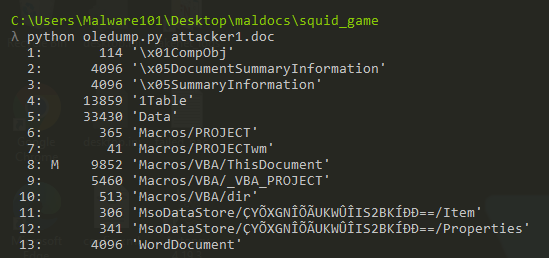

We see presence of macro in stream 8, so we can go ahead and use oledump to further analyze the doc. If we check the help function of oledump:
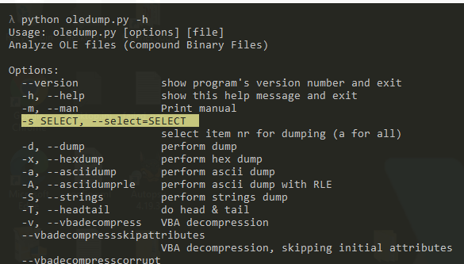

We can use -s to select the stream i.e 8 and use -v for vbadecompress to see the VBA code.
I decided to store the output in a text file and opened it in sublime text.
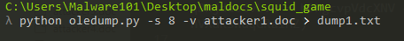
If you check the output it is still somehow obfuscated still.
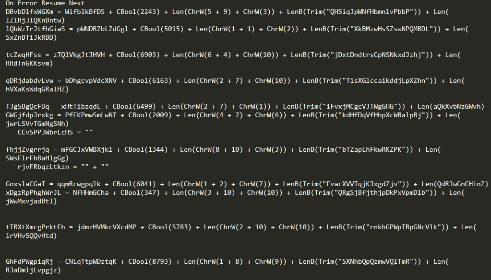
So we can try to get the output of the other streams to see if they have anything. We start with stream 1 and so forth. We can add the -S for strings option for it to output the strimgs only without the hex.
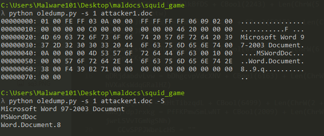
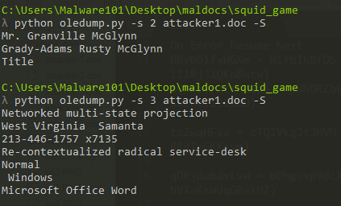
SIDENOTE: I later found out that the output we got for stream 1,2 and 3 we can get the same output using the exiftool command.
In stream 4, we get something interesting, so I saved it in a text file.
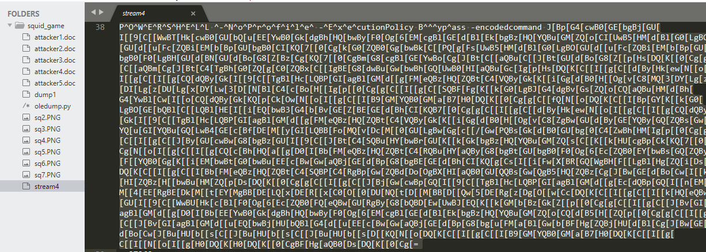
That seems like a powershell command but it’s somehow obsfucated with brackets and what seems like base64 encoding. We can use cyberchef for easier deobsfucation. Copy that command starting from "J[" since the first part we aready know is a powershell command. Matter of fact let’s put that command in a new file. We can use the replace function in sublime text and replace ^ with an empty string and we’ll get the following:
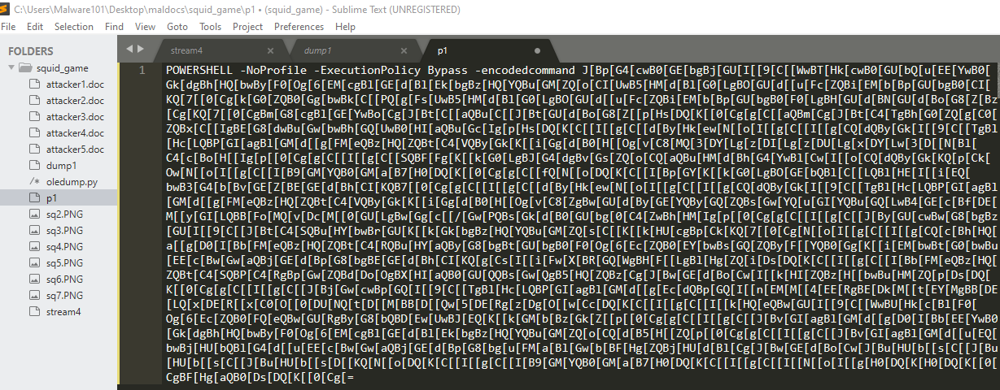
That’s better. Anyway moving on, since we already copied the command in cyberchef, if we try decoding from base64 we’ll get:
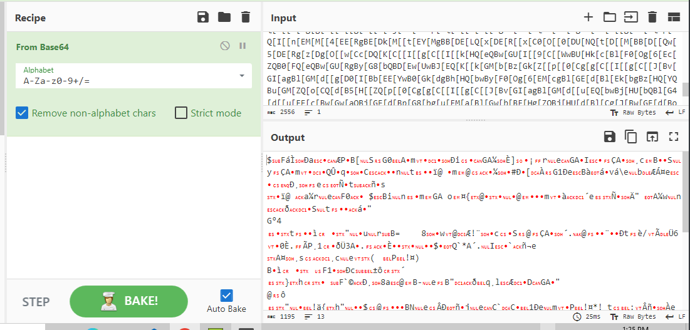
We still get some gibberish output, now time to analyze further. Looking at the obsfucated code we see a huge use of “[”. At this point I went down a rabbit hole but Looking back at the output of stream 8 where we saw presence of macros, I saw something interesting:
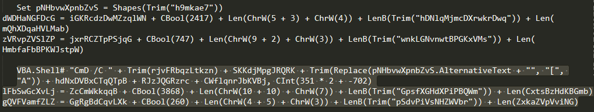
That somehow seems like a replace function where “[” is replaced with A, let’s try that. I used find/replace function in cyberchef. then decode from base64 and also remove the null bytes, we get:
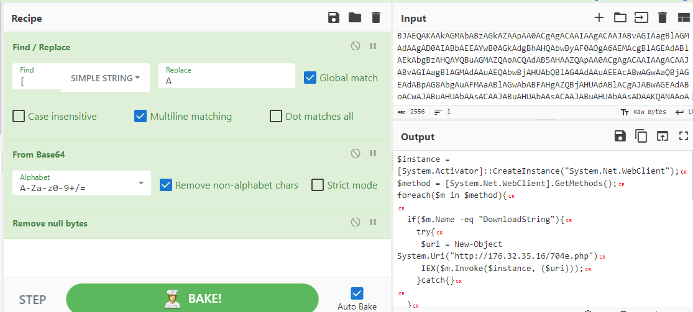
That’s a much cleaner output. We can see the c2 domain from the output.
From the output we can answer question 1 and 2. In the next question it asks about the specific folder. Checking this command where we get the executable being dropped to:
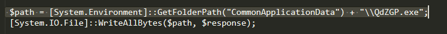
Doing a google search on “CommonApplicationData” we get the answer. Next question we check the hint and says we check the clsid field.
Doing a google search on the GUID, I found this [site](https://strontic.github.io/xcyclopedia/library/clsid_c08afd90-f2a1-11d1-8455-00a0c91f3880.html) which was super helpful. Looking at the output we get our answer. That was pretty straight forward. Next was about finding a phone number. Remember when I said exiftool could be used to get some information, well that’s what we’ll use.
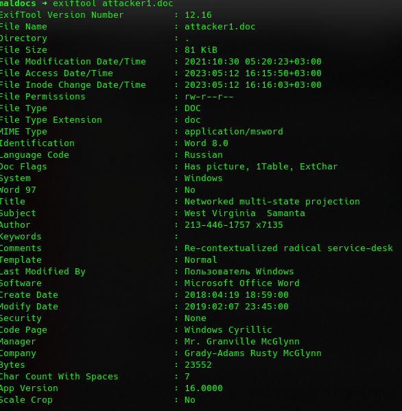
In the author section, we get the answer. Next question, we’ll use the olevba command to get our answer.
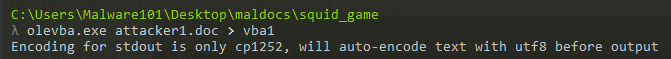
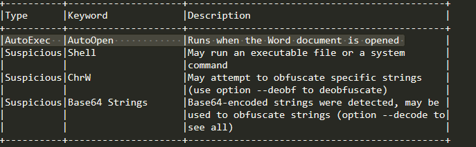
For the subject, we can use the file command on the “attacker1.doc” and get the answer.
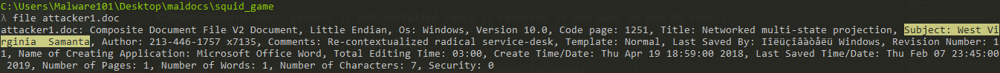
Next question, We can use oletimes command to get the answer.
For the last 2 answers, we already found the stream which had macros which was 8 and when we used the oledump command on stream 8 we got the name of the stream.

On to the next task!!


