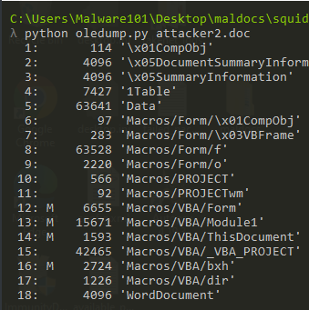
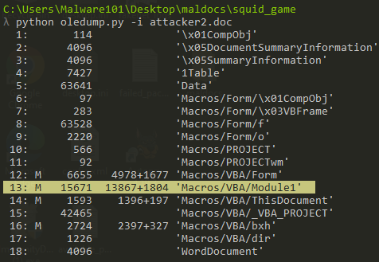
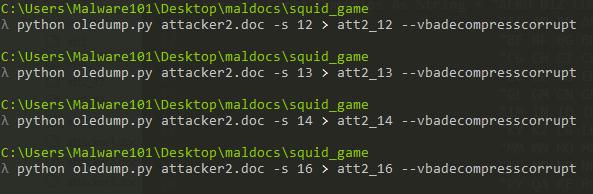
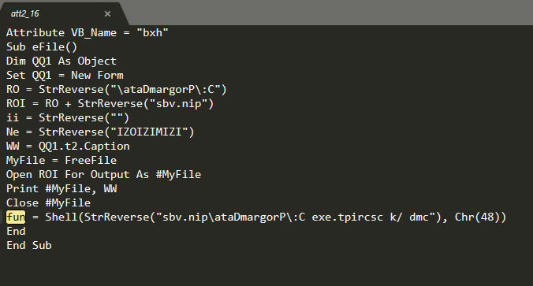
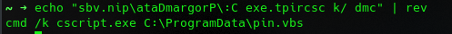
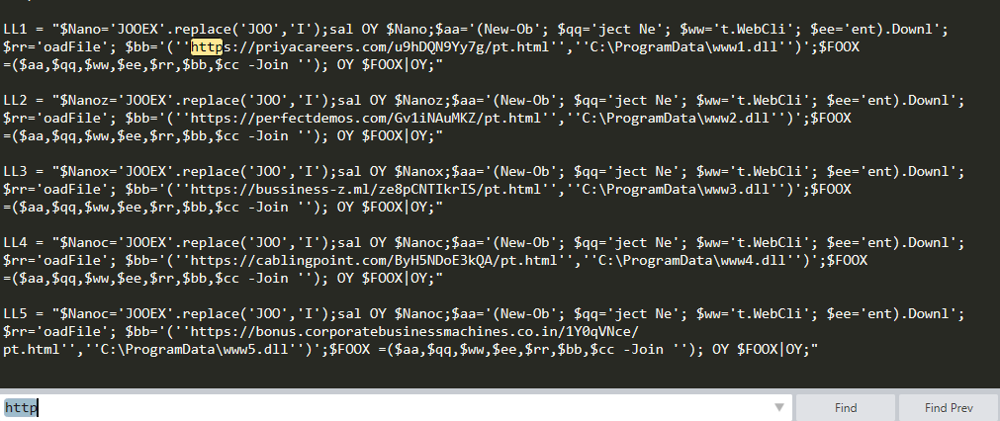
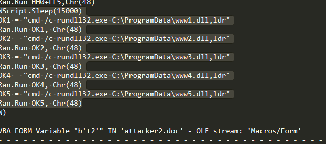
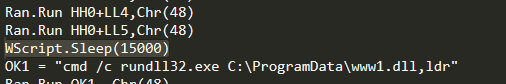
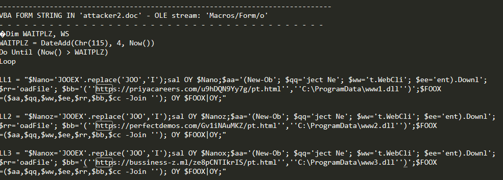

### Attacker 2
So for this we do the usual, we use oledump to find the macros.
```bash
 oledump attacker2.doc
 ```
 
 
 The above command gives us the answers for questions 1&3.
 For question 2, at first I thought the answer was the bytes of the macro but it was incorrect, so I looked in the help page of oledump to seeif I could anything. I see "-i" for printing extra information. When I used that option I got the answer.


Next question was to find the command in 'fun field', what could that possibly mean?
In oledump there is an option to select the stream "-s". 
I dumped all the streams with macros and searched for "fun" in each and every stream.

I found the field in stream 16, so I reversed the string and got the answer.



Next 2 questions were about finding domains in the maldoc. A pretty good time to use olevba, right?
```bash
 olevba attacker2.doc
 ```
I saved the output to a text file. Since we are looking for a domain I seached for the string "http"
 
 That output has the answer even to the first DLL it retrieved from the server.

 For the number of DLLS the maldoc retrieves, initially I thought it was 4 since in the c2 domains I saw only 4, but going the output, I saw the following:
 

 Next question was about the path, the DLLS were being dropped onto. In the above image we clearly see the path the DLLS were being dropped into and the program that was used to run the DLLS.

 Next one: 
 "How many seconds does the function in the maldoc sleep for to fully execute the malicious DLLs?"

 For this also the answer was in the vba output. I saw a wscript.sleep function.

 But I looking at the answer, it had only 2 digits, so those must be milliseconds or something like that. Anyway this [example](https://ss64.com/vb/sleep.html) helped me to get the answer.

Last question
"Under what stream did the main malicious script use to retrieve DLLs from the C2 domains? (Provide the name of the stream)."

In the vba output where we found our c2 domains, olevba already gave us the name of the macros stream.


In my opinion, this was a bit easy compared to the first one.


