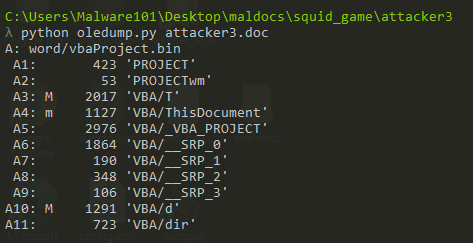
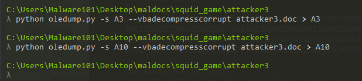
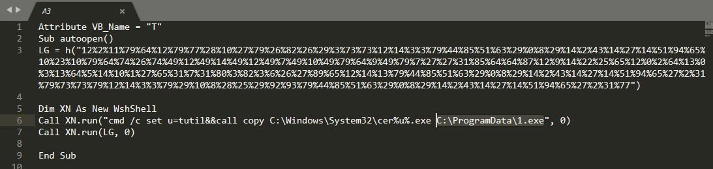
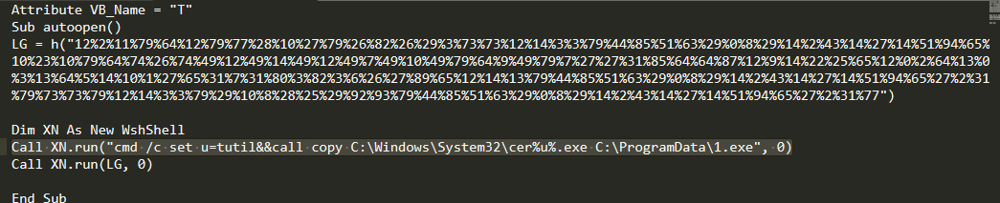

### Task 3: Attacker 3
#### Provide the executable name being downloaded.
We use oledump to find how many streams have macros(M).

We see 2 streams, we use oledump again with -s for selecting stream number and --vbadecompresscourrupt to decompress the vba output.

#### What program is used to run the executable?
For this answer I got it pretty straight forward, but it can be confusing at first, in the A3 stream output, I saw the program that was used to run the downloaded executable but it was somehow obsfucated.

Looking at the command we see u=tutil then the u being used in the following command to run the executable.

#### Provide the malicious URI included in the maldoc that was used to download the binary (without http/https)
For this since the A10 stream did not have anything useful, we can use olevba command to dump the vba of the maldoc. Also to find IOCs we can use virustotal right? That idea came to way after I tried to deobsfucate the macro.
You can find the results of the hash [here](https://www.virustotal.com/gui/file/b156c9ad046d0d4b174f7308bd3b965f4425b1dfa38e7dc19e6e1eb54b0b49a1/relations)

Anyway, we can use a tool called [vipermonkey](https://github.com/decalage2/ViperMonkey) that basically tries to deobsfucate and analyze VBA macros.
This tool comes pre installed in both Flare-vm and also Remnux but for some reason it was not in my flare-vm so I opted to use remnux. In the last output of the results we see the full url.
[image](sq5.png)

#### What folder does the binary gets dropped in?
Back to the output that had the executable being dropped to, we see the folder that the file was dropped to.

#### Which stream executes the binary that was downloaded?
Looking back at the oledump output, we definitely know the stream which executes the binary was the one which first downloaded the binary the ran it using certutil.

Another maldoc Done!!

