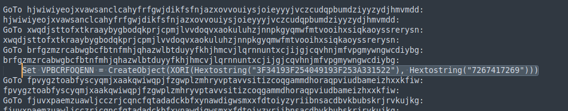

### Task 4: Attacker 4
#### Provide the first decoded string found in this maldoc.

First we need to see the stream with the macros.
  
In this macro we see a lot of obsfucated strings but going down the file, there is something interesting.
 

But what is XORI in macros? A quick [google search](https://www.trustwave.com/en-us/resources/blogs/spiderlabs-blog/deobfuscating-malicious-macros-using-python/) revealed the answer. So to get the decoded string we need to first convert (3F34193F254049193F253A331522) from hex then xor it with the key given(7267417269).
[cyberchef](https://gchq.github.io/CyberChef/#recipe=From_Hex('Auto')XOR(%7B'option':'Hex','string':'7267417269'%7D,'Standard',false)&input=M0YzNDE5M0YyNTQwNDkxOTNGMjUzQTMzMTUyMg) does the work pretty fast.

#### Provide the name of the binary being dropped.
So lets see if there are any other obfsucated strings like the last one and try to decode them. So I searched for the string "xori" in the output and went on from there.
Next string is this one:

The output gives us "GET" that's a good lead.
I decoded the rest of the xor strings and one of them gave me the binary.

#### Provide the folder where the binary is being dropped to.
Without much decoding one can easily see the folder where the binary was being dropped.

#### Provide the name of the second binary.
For this, since I had decoded all the strings, I got the answer pretyy quickly.

#### Provide the full URI from which the second binary was downloaded (exclude http/https).

The URL also was also quick to notice.

Not so hard after all...

