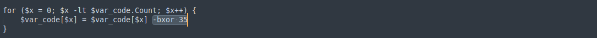

### Task 5: Attacker 5

Final task, let's go!!!

#### What is the caption you found in the maldoc?

We use oledump as usual.

At first I thought that the caption was "catchmeifyoucan" but I was wrong. So I decided to dump the all the streams one by one and save them to text files and see if I could find the "caption", I added the -S option to print only the strings in the streams.

To save some time, the caption was in stream 6.

#### What is the XOR decimal value found in the decoded-base64 script?
In stream 7 there is a string that seems like base64.

Copy the base64 and decode it using cyberchef and also remove the null bytesto get a cleaner output.
 Looking at the output it seems this base64 is compressed, this is evident since it uses gzip.
Luckily in cyberchef there is an operation called "gunzip" which we can take advantage of:
I copied the new base64 and did the operation.
 Looking at the new output there is a for loop  which does some kind of operation like xor which by the way is bxor(bitwise xor) and we get our answer.

#### Provide the C2 IP address of the Cobalt Strike server. 
Looking at the decompressed code there is still some more base64, let's decode the string.  Remember we found our bxor decimal to be 35 that is what will use to get the output.  The output is still gibberish but there are some readble strings. 

So The next step was to save the file and transfer it to my vm, to analyze further since this seemed like a shellcode hence cyberchef was not able to decode the base64.
Now a really good tool for shellcode analysis is a tool called scdbg(shellcode debug). Again, this tool comes pre installed in both remnux and flare-vm. scdbg is the GUI version while scdbgc is the terminal version(this case applies only to REMnux).
So to analyze the shellcode , we will use the following command.
```bash
 scdbgc /f download.dat /s -1
 ```

/f option is to specify the file name and /s -1 is for the number of steps that will parse out in the shellcode, the -1 is for unlimited number of steps. 
This shellcode analysis gives us the answer to the rest of the questions.

Referring to the shellcode analysis, we see an API call to internetconnect which has an IP address and the server.


#### Provide the full user-agent found.
We see an API call to HttpSendRequestA which has the user-agent.


#### Provide the path value for the Cobalt Strike shellcode.
In reference to the shellcode analysis , we see an API call to HttpOpenRequestA which has a path.

#### Provide the port number of the Cobalt Strike C2 Server.
The API call to internet connect has the answer.

#### Provide the first two APIs found.
In the shellcode analysis, we can clearly see the first 2 API calls that the shellcode does.


Wheew!! That was a long one.

### Final Thoughts
This was a really nice challenge that enhanced my skills in analyzing maldoc files.
This came way later after I finished the challenge, I learnt a very nice and quick way from [almond force's channel](https://www.youtube.com/@AlmondForce) on how to search for a specific string in a maldoc using oledump, say for instance in the attacker 5 say we want to search for the caption as per question 1 in task 5, we can use the following one liner.

```bash
for i in {1..16};do echo "$i, $(python oledump.py -s $i -S attacker5.doc | grep -e '[Cc]aption')";done
 ```
And with that...


