Hello Everyone, it has been a minute since my last blog but 


I have been recently doing [OCH](https://www.ongozacyberhub.org/) which is a good mastery(you should check them out), I have been specializing on the cloud security path since I am new to the field. In our track we were to do a project based on cloud specifically AWS, our mentor [Dennis Mensa](https://gh.linkedin.com/in/dennisawermensah) gave us a good [resource](https://workshops.aws/) to choose from since the AWS cloud security is wide.

Upon going through the workshops I decided to go with [Cryptominer Based Security Events](https://catalog.us-east-1.prod.workshops.aws/workshops/ea9c0361-001f-4194-963e-06b07c3e5d6b/en-US) which is a workshop where we will start five EC2 instances using a CloudFormation template in order to mimic a cryptomining security event. By sending DNS queries to well-known cryptomining sites, these five EC2 instances will simulate cryptomining activity. After that, you will learn how to use the AWS CIRT (Customer Incident Response Team) to identify evidence of unauthorized activity and be exposed to some of the procedures and tools in response to similar incidents. 

This is a blog that will be covering how I did that.


### Introduction
This is a good workshop that I used [CloudFormation](https://aws.amazon.com/cloudformation/). Amazon Web Services offers a solution called AWS CloudFormation that lets customers securely and automatically model and manage infrastructure resources. 
I created 5 EC2 instances using the template from CloudFormation which will mimic cryptomining activity.
After that I implemented tools to use to respond to such events and learn how to find evidence of such an unathorized activity which will be covered below. All this can be done on the AWS free tier.


### Some of the Tools To Be Used
-  Assisted Log Enabler
An open source application called Assisted Log Enabler for AWS was created to relieve customers of the hassle of activating logging features during a security incident. An Amazon Simple Storage Service (Amazon S3) bucket is created by Assisted Log Enabler for AWS, which also checks the services to determine if logging is enabled and, if not, activates it.

-  AWS Security Analytics Bootstrap
Customers may conduct security investigations on AWS service logs thanks to the AWS Security Analytics Bootstrap, which offers an Amazon Athena analysis environment that is simple to maintain, quick to deploy, and ready to use.

**Note**: The AWS also provides a very comprehensive Incident Response Playbooks for various Scenarios. You can find them [here](https://github.com/aws-samples/aws-customer-playbook-framework/tree/main/docs)


### Setting Up The Lab Environment
This section covers how I created the lab used for detection and analysis together with the tools needed. 

### Using CloudFormation
I used CloudFormation template to install the EC2 instances. AWS provided a [template](https://static.us-east-1.prod.workshops.aws/public/c976405b-1a71-4e59-a4b6-8e97f9b56527/static/TDIRWorkshopStack-auto.yml) for that. 

**Note** One does not need to enable GuardDuty on our account if not enabled. Amazon VPC Flow Logs, DNS logs, AWS CloudTrail event logs, and AWS CloudTrail management events are among the fundamental data sources that GuardDuty, a threat detection service, keeps an eye on. Additionally, GuardDuty only analyzes features related to its protection categories if you enable them individually.

The script already has a section of enabling GuardDuty as shown below:
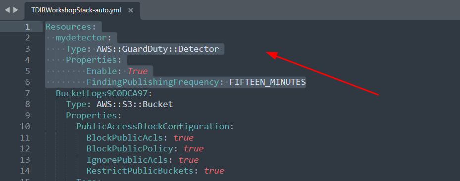

It is good to note that if an AWS Account has GuardDuty already set one needs to delete those lines as the template will fail.

Now I went back to [AWS Console](https://aws.amazon.com/console/) and searched for CloudFormation to upload our template. I created a stack and uploaded our template. I left all the settings as default.
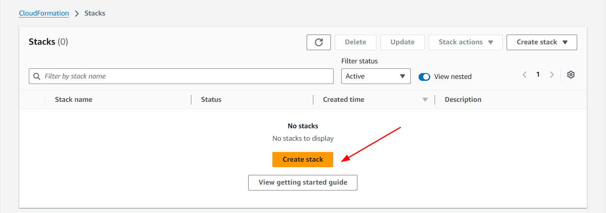

When finished it should look something like the below image:
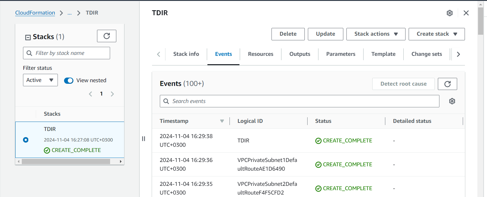


### Using Athena
In the template that I used above, it also included [Athena](https://aws.amazon.com/athena/) which is a serverless interactive query service that allows you to query data sets using standard SQL. 
To run Athena, I went back to AWS console and searched for Athena, As per the guide here is how it should look like:

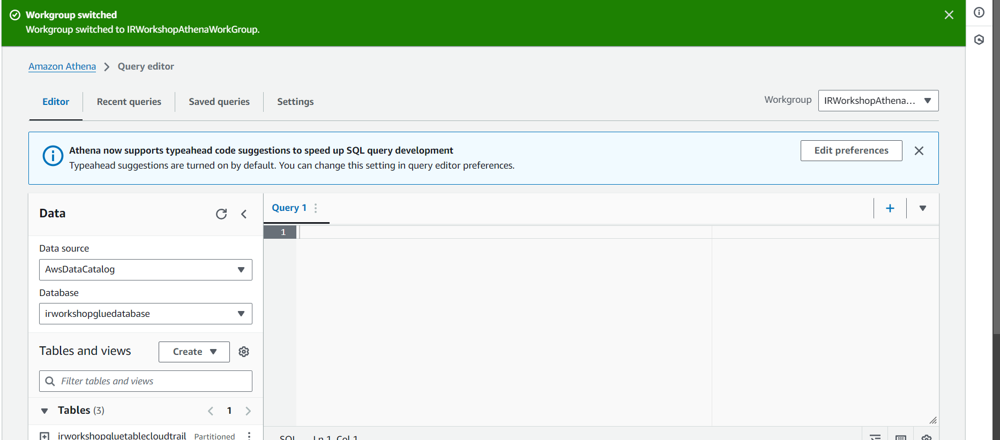

I tested a query to see if Athena was running correctly.

```SELECT * FROM "irworkshopgluedatabase"."irworkshopgluetablevpcflow" limit 10;```

Here is a snippet of the results:
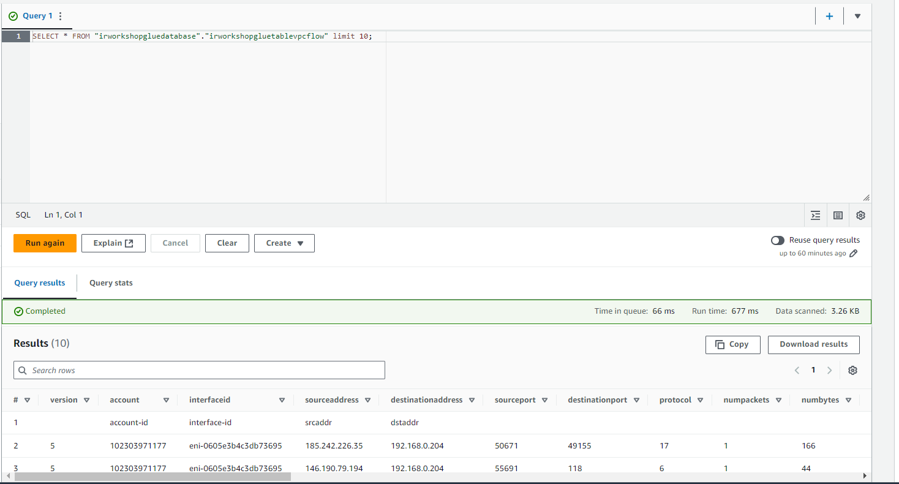

This is a simple SQL query in which the SELECT statement is used to retrieve data from a specific table(irworkshopgluetablevpcflow) in a database(irworkshopgluedatabase). LIMIT 10 restricts the result set to the first 10 rows. 

### Reviewing Logs
When reviewing logs it is essential to have some fields of interest  which are created by the Security Analytics Bootstrap as shown below:

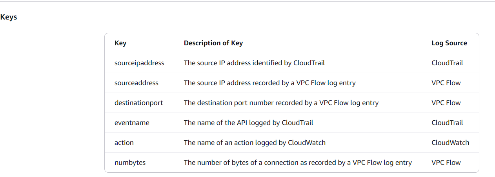

Here are some events which can deemed as malicious.
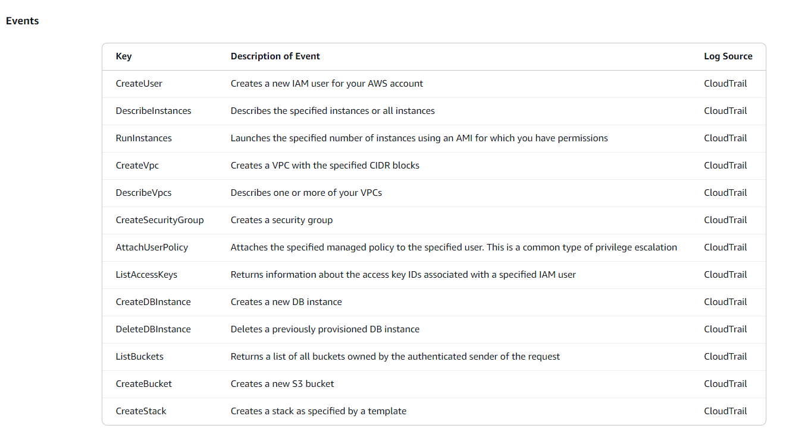

We can also see some saved queries that came bundled with our template that we installed via cloudfront.
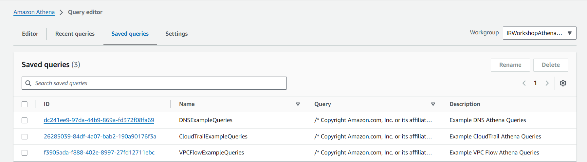

I created a query from the saved queries, in this case a query to obtain a User Activity Summary, filtering only on high volume read-only GET/LIST/DESCRIBE calls. This was obtained from one of the saved queries `CloudTrailExampleQueries`. I edited the date and account set to my account ID

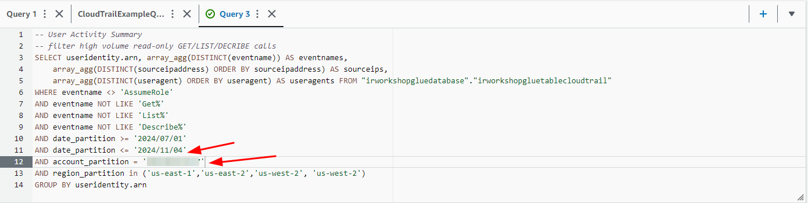

Results:
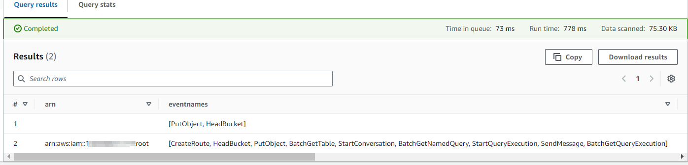

These queries are important since I used them in Detection

### Simulation
Here is where I simulated the creation of cryptomining resources in which this unauthorized use is commonly performed using the creation of stacks with CloudFormation.


AWS Provided a [bash script](https://static.us-east-1.prod.workshops.aws/public/c976405b-1a71-4e59-a4b6-8e97f9b56527/static/start_cryptomining_simulation.sh) which also made use of CloudFormation for simulation.

I launched AWS Cloudshell.
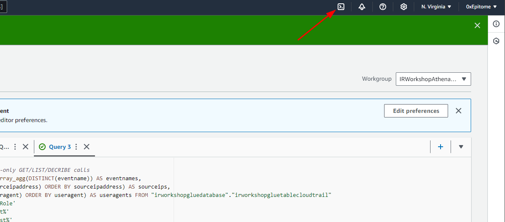 and in the actions tab I clicked on upload and uploaded the file
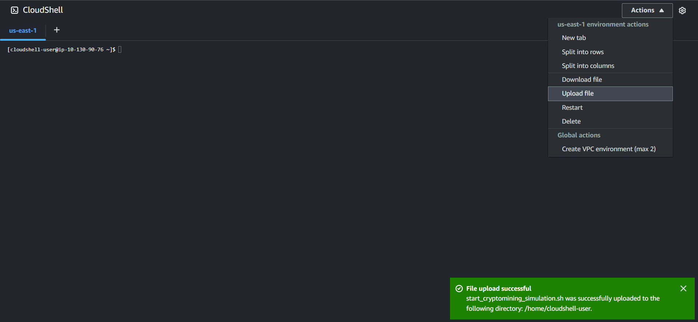
After that I made the script executable and I ran it.
`chmod +x start_cryptomining_simulation.sh
./start_cryptomining_simulation.sh`
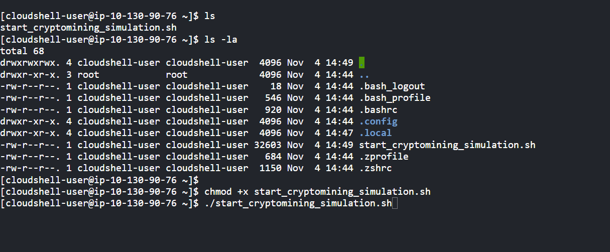

Now the basic functionality of the script automates the creation of AWS resources, including EC2 instances and a CloudFormation stack, in that each of the instances send DNS queries to known cryptomining domains to simulate cryptomining activity. It also creates 2 txt files as seen in the 2 `echo` commands after `echo "Creating Resources for Simulation..."`
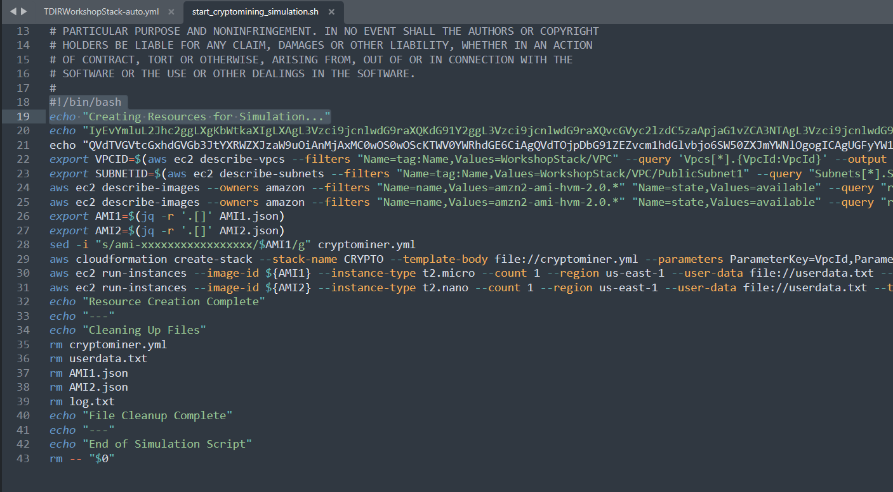

The first one takes a large base64 code and puts it to userdata.txt. This code does the dig command to some of the known crypto mining sites 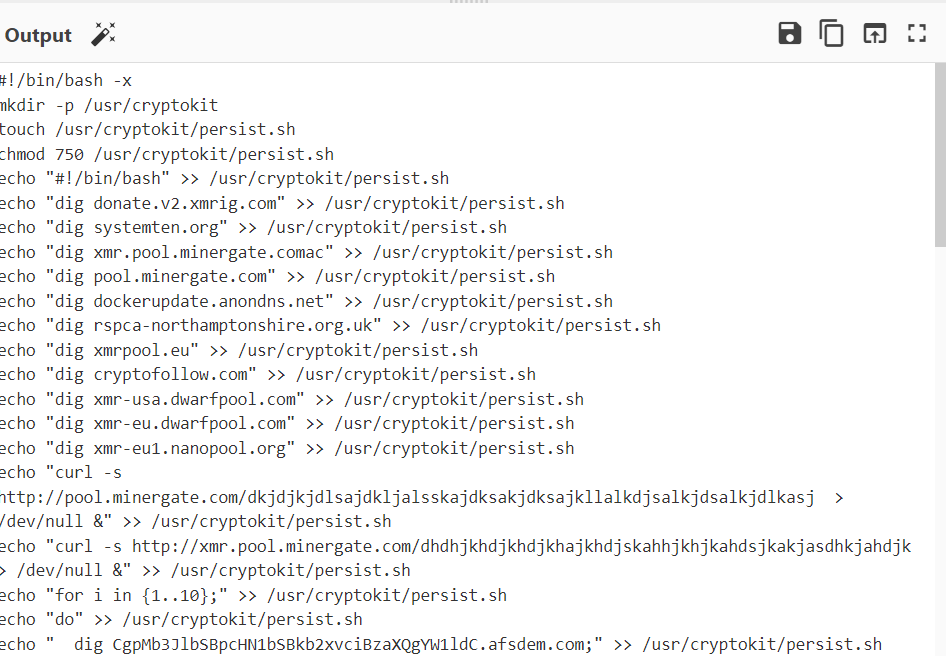
You can find the decoded version [here](https://gchq.github.io/CyberChef/#recipe=From_Base64('A-Za-z0-9%2B/%3D',true,false)&input=Ikl5RXZZbWx1TDJKaGMyZ2dMWGdLYld0a2FYSWdMWEFnTDNWemNpOWpjbmx3ZEc5cmFYUUtkRzkxWTJnZ0wzVnpjaTlqY25sd2RHOXJhWFF2Y0dWeWMybHpkQzV6YUFwamFHMXZaQ0EzTlRBZ0wzVnpjaTlqY25sd2RHOXJhWFF2Y0dWeWMybHpkQzV6YUFwbFkyaHZJQ0lqSVM5aWFXNHZZbUZ6YUNJZ1BqNGdMM1Z6Y2k5amNubHdkRzlyYVhRdmNHVnljMmx6ZEM1emFBcGxZMmh2SUNKa2FXY2daRzl1WVhSbExuWXlMbmh0Y21sbkxtTnZiU0lnUGo0Z0wzVnpjaTlqY25sd2RHOXJhWFF2Y0dWeWMybHpkQzV6YUFwbFkyaHZJQ0prYVdjZ2MzbHpkR1Z0ZEdWdUxtOXlaeUlnUGo0Z0wzVnpjaTlqY25sd2RHOXJhWFF2Y0dWeWMybHpkQzV6YUFwbFkyaHZJQ0prYVdjZ2VHMXlMbkJ2YjJ3dWJXbHVaWEpuWVhSbExtTnZiV0ZqSWlBK1BpQXZkWE55TDJOeWVYQjBiMnRwZEM5d1pYSnphWE4wTG5Ob0NtVmphRzhnSW1ScFp5QndiMjlzTG0xcGJtVnlaMkYwWlM1amIyMGlJRDQrSUM5MWMzSXZZM0o1Y0hSdmEybDBMM0JsY25OcGMzUXVjMmdLWldOb2J5QWlaR2xuSUdSdlkydGxjblZ3WkdGMFpTNWhibTl1Wkc1ekxtNWxkQ0lnUGo0Z0wzVnpjaTlqY25sd2RHOXJhWFF2Y0dWeWMybHpkQzV6YUFwbFkyaHZJQ0prYVdjZ2NuTndZMkV0Ym05eWRHaGhiWEIwYjI1emFHbHlaUzV2Y21jdWRXc2lJRDQrSUM5MWMzSXZZM0o1Y0hSdmEybDBMM0JsY25OcGMzUXVjMmdLWldOb2J5QWlaR2xuSUhodGNuQnZiMnd1WlhVaUlENCtJQzkxYzNJdlkzSjVjSFJ2YTJsMEwzQmxjbk5wYzNRdWMyZ0taV05vYnlBaVpHbG5JR055ZVhCMGIyWnZiR3h2ZHk1amIyMGlJRDQrSUM5MWMzSXZZM0o1Y0hSdmEybDBMM0JsY25OcGMzUXVjMmdLWldOb2J5QWlaR2xuSUhodGNpMTFjMkV1WkhkaGNtWndiMjlzTG1OdmJTSWdQajRnTDNWemNpOWpjbmx3ZEc5cmFYUXZjR1Z5YzJsemRDNXphQXBsWTJodklDSmthV2NnZUcxeUxXVjFMbVIzWVhKbWNHOXZiQzVqYjIwaUlENCtJQzkxYzNJdlkzSjVjSFJ2YTJsMEwzQmxjbk5wYzNRdWMyZ0taV05vYnlBaVpHbG5JSGh0Y2kxbGRURXVibUZ1YjNCdmIyd3ViM0puSWlBK1BpQXZkWE55TDJOeWVYQjBiMnRwZEM5d1pYSnphWE4wTG5Ob0NtVmphRzhnSW1OMWNtd2dMWE1nYUhSMGNEb3ZMM0J2YjJ3dWJXbHVaWEpuWVhSbExtTnZiUzlrYTJwa2FtdHFaR3h6WVdwa2EyeHFZV3h6YzJ0aGFtUnJjMkZyYW1ScmMyRnFhMnhzWVd4clpHcHpZV3hyYW1SellXeHJhbVJzYTJGemFpQWdQaUF2WkdWMkwyNTFiR3dnSmlJZ1BqNGdMM1Z6Y2k5amNubHdkRzlyYVhRdmNHVnljMmx6ZEM1emFBcGxZMmh2SUNKamRYSnNJQzF6SUdoMGRIQTZMeTk0YlhJdWNHOXZiQzV0YVc1bGNtZGhkR1V1WTI5dEwyUm9aR2hxYTJoa2FtdG9aR3ByYUdGcWEyaGthbk5yWVdob2FtdG9hbXRoYUdSemFtdGhhMnBoYzJSb2EycGhhR1JxYXlBZ1BpQXZaR1YyTDI1MWJHd2dKaUlnUGo0Z0wzVnpjaTlqY25sd2RHOXJhWFF2Y0dWeWMybHpkQzV6YUFwbFkyaHZJQ0ptYjNJZ2FTQnBiaUI3TVM0dU1UQjlPeUlnUGo0Z0wzVnpjaTlqY25sd2RHOXJhWFF2Y0dWeWMybHpkQzV6YUFwbFkyaHZJQ0prYnlJZ1BqNGdMM1Z6Y2k5amNubHdkRzlyYVhRdmNHVnljMmx6ZEM1emFBcGxZMmh2SUNJZ0lHUnBaeUJEWjNCTllqTktiR0pUUW5CalNFNHhZbE5DYTJJeWVIWmphVUo2WVZoUloxbFhNV3hrUXk1aFpuTmtaVzB1WTI5dE95SWdQajRnTDNWemNpOWpjbmx3ZEc5cmFYUXZjR1Z5YzJsemRDNXphQXBsWTJodklDSWdJR1JwWnlCM1oxa3lPWFZqTWxacVpFZFdNR1JZU1dkWlYxSndZMGRzZWxreWJIVmFlVUpzWWtkc01DNWhabk5rWlcwdVkyOXRPeUlnUGo0Z0wzVnpjaTlqY25sd2RHOXJhWFF2Y0dWeWMybHpkQzV6YUFwbFkyaHZJQ0lnSUdScFp5Qk1hVUpYV2xoT01HRlhTakZpU0ZaMFNVZEdha2xJU25Cak0xWjZTVWRTZG1KSE9YbE1hUzVoWm5Oa1pXMHVZMjl0T3lJZ1BqNGdMM1Z6Y2k5amNubHdkRzlyYVhRdmNHVnljMmx6ZEM1emFBcGxZMmh2SUNJZ0lHUnBaeUJDU21KcFFteGtVMEp3WWxoQ2JHTnRVbkJhV0ZGbllsZHJjMGxIYkd0SlNFNXFXbGQ0YkM1aFpuTmtaVzB1WTI5dE95SWdQajRnTDNWemNpOWpjbmx3ZEc5cmFYUXZjR1Z5YzJsemRDNXphQXBsWTJodklDSWdJR1JwWnlCamJXeDZZMWhXYkVsSE9YbFpNbXQxU1VVMU1XSkhlR2hpVTBJeFpFTkNjMkZYU214amJTNWhabk5rWlcwdVkyOXRPeUlnUGo0Z0wzVnpjaTlqY25sd2RHOXJhWFF2Y0dWeWMybHpkQzV6YUFwbFkyaHZJQ0lnSUdScFp5QTRaMk5JVm5sa1dFMTFTVVpDYkdKSGVHeGlibEpzWXpOR01WcFRRbWhrUTBKdFkyMXNkUzVoWm5Oa1pXMHVZMjl0T3lJZ1BqNGdMM1Z6Y2k5amNubHdkRzlyYVhRdmNHVnljMmx6ZEM1emFBcGxZMmh2SUNJZ0lHUnBaeUJhTW14ellrZEZaMkpYVmpCa1dFMXpTVWRHYWtsSVZuTmtTRXB3V1RKV2VrbEhWbmxaV0M1aFpuTmtaVzB1WTI5dE95SWdQajRnTDNWemNpOWpjbmx3ZEc5cmFYUXZjR1Z5YzJsemRDNXphQXBsWTJodklDSWdJR1JwWnlCUmRVbEZXakZqTWs1c1NVZE9NV051VGpGamVVSjBZako0YzJGWVRXZGpiV3g2WkZoTlp5NWhabk5rWlcwdVkyOXRPeUlnUGo0Z0wzVnpjaTlqY25sd2RHOXJhWFF2Y0dWeWMybHpkQzV6YUFwbFkyaHZJQ0lnSUdScFp5QmtXRkZuWkZkNE1HTnRiR3BoVjFaNlRHbENUMWxYTUdkaVYwWjZZekpGWjJGdVZucGtSeTVoWm5Oa1pXMHVZMjl0T3lJZ1BqNGdMM1Z6Y2k5amNubHdkRzlyYVhRdmNHVnljMmx6ZEM1emFBcGxZMmh2SUNJZ0lHUnBaeUE0YzBsSVZuTmtTRXB3V1RKc2JHTjVRbWhrVjA0d1lqTkpaMkpYYTJka1dGRnpTVWRTY0M1aFpuTmtaVzB1WTI5dE95SWdQajRnTDNWemNpOWpjbmx3ZEc5cmFYUXZjR1Z5YzJsemRDNXphQXBsWTJodklDSWdJR1JwWnlCWk0xSXhZbE5DYzJJeVNuWmpibEp3WTNsQ2RXUlhlSE5aVXpSblZHNVdjMkpIUldkak1pNWhabk5rWlcwdVkyOXRPeUlnUGo0Z0wzVnpjaTlqY25sd2RHOXJhWFF2Y0dWeWMybHpkQzV6YUFwbFkyaHZJQ0lnSUdScFp5QnNNRWxIUm5SYVdGRm5XbTFXYzJGWVRXZGliVGwxU1Vkc2QyTXpWblJKU0Zwc1l6TlNjQzVoWm5Oa1pXMHVZMjl0T3lJZ1BqNGdMM1Z6Y2k5amNubHdkRzlyYVhRdmNHVnljMmx6ZEM1emFBcGxZMmh2SUNJZ0lHUnBaeUJaYmxaelpGY3daMk50YUhaaWJVNHhZM2swWjFSSE9YbGFWekJuWVZoQ2VtUlhNR2RhUnk1aFpuTmtaVzB1WTI5dE95SWdQajRnTDNWemNpOWpjbmx3ZEc5cmFYUXZjR1Z5YzJsemRDNXphQXBsWTJodklDSWdJR1JwWnlBNWMySXpTV2RqTW13d1NVZEdkRnBZVVhOSlIwNTJZbTVPYkZrelVteGtTRlo1U1VkR2F5NWhabk5rWlcwdVkyOXRPeUlnUGo0Z0wzVnpjaTlqY25sd2RHOXJhWFF2Y0dWeWMybHpkQzV6YUFwbFkyaHZJQ0lnSUdScFp5QmhXRUp3WXpKT2NHSnRZMmRhVjNod1pFTTBaMU5YTkdkYWJVWXhXVEpzYVdSWVRXZGhWeTVoWm5Oa1pXMHVZMjl0T3lJZ1BqNGdMM1Z6Y2k5amNubHdkRzlyYVhRdmNHVnljMmx6ZEM1emFBcGxZMmh2SUNJZ0lHUnBaeUJSWjFwWGVIQmtRMEpvWkVOQ2RGbFlhSEJpV0ZaNlRHbENRbUpIYkhoa1YwWjBTVWRTYUM1aFpuTmtaVzB1WTI5dE95SWdQajRnTDNWemNpOWpjbmx3ZEc5cmFYUXZjR1Z5YzJsemRDNXphQXBsWTJodklDSWdJR1JwWnlCalIyeHBaRmhOWjJSWVVXZGlWMFl4WTIxc2VrbEhOV3haZVVKdFdWaFdhbUZYU2pGamVTNWhabk5rWlcwdVkyOXRPeUlnUGo0Z0wzVnpjaTlqY25sd2RHOXJhWFF2Y0dWeWMybHpkQzV6YUFwbFkyaHZJQ0lnSUdScFp5QTBaMVZJU25aaFZ6Um5XVmhXYW1SSE9YbEpSM2h3V1cxV2VXSjVRblZhVjAxbldWaFdiaTVoWm5Oa1pXMHVZMjl0T3lJZ1BqNGdMM1Z6Y2k5amNubHdkRzlyYVhRdmNHVnljMmx6ZEM1emFBcGxZMmh2SUNJZ0lHUnBaeUJrVjFWbll6SkdibUZZVWpCaFdFMW5XVEk1ZFZwSGJIUmFWelV3WkZjd2RVbEdXbXhqTXk1aFpuTmtaVzB1WTI5dE95SWdQajRnTDNWemNpOWpjbmx3ZEc5cmFYUXZjR1Z5YzJsemRDNXphQXBsWTJodklDSWdJR1JwWnlCU2NGbHVWbk5rVnpCbldXMXNhVnBYTld0a1Z6Qm5ZakpTY0dKNVFuaGtWMFowVEVOQ2FDNWhabk5rWlcwdVkyOXRPeUlnUGo0Z0wzVnpjaTlqY25sd2RHOXJhWFF2Y0dWeWMybHpkQzV6YUFwbFkyaHZJQ0lnSUdScFp5QmtRMEpxWWpJMWJtUlhWV2RpYmxaellrZEZaMlJ0YkRKYVdFcDVXVk5DY0dKcE5HZFRWeTVoWm5Oa1pXMHVZMjl0T3lJZ1BqNGdMM1Z6Y2k5amNubHdkRzlyYVhRdmNHVnljMmx6ZEM1emFBcGxZMmh2SUNJZ0lHUnBaeUEwWjJSWGVEQmpiV3hxWVZkV2VrbElVakZqYmtKd1kzbENhR1JEUW0xWlYwNXdZa2RzZWk1aFpuTmtaVzB1WTI5dE95SWdQajRnTDNWemNpOWpjbmx3ZEc5cmFYUXZjR1Z5YzJsemRDNXphQXBsWTJodklDSWdJR1JwWnlCaFdFMW5Xa2RzYW1SSVZuUk1hVUpHWkVkc2FHSlRRblZoV0U1d1NVZEdkV1JIVlhOSlJ5NWhabk5rWlcwdVkyOXRPeUlnUGo0Z0wzVnpjaTlqY25sd2RHOXJhWFF2Y0dWeWMybHpkQzV6YUFwbFkyaHZJQ0lnSUdScFp5QlNjRmt6VWpGaVUwSnNaRU5DYjFwWE5XdGpiVlo1WVZoUloySnRWbXBNUTBKNllqSlNhQzVoWm5Oa1pXMHVZMjl0T3lJZ1BqNGdMM1Z6Y2k5amNubHdkRzlyYVhRdmNHVnljMmx6ZEM1emFBcGxZMmh2SUNJZ0lHUnBaeUJpUjFaNlNVZHNhMGxIVm5saU0wMTFRMmR3VVdGSFJucGFWM2h6WkZoTloxcHRWakZhTWk1aFpuTmtaVzB1WTI5dE95SWdQajRnTDNWemNpOWpjbmx3ZEc5cmFYUXZjR1Z5YzJsemRDNXphQXBsWTJodklDSWdJR1JwWnlCc2FHUkRRblZrVnpWcVNVaE9iRnBEUW5wa1dFNXFZVmhDY0dSRFFtMVpXRlpxWVZkS01TNWhabk5rWlcwdVkyOXRPeUlnUGo0Z0wzVnpjaTlqY25sd2RHOXJhWFF2Y0dWeWMybHpkQzV6YUFwbFkyaHZJQ0lnSUdScFp5QmplVFJuVVZkV2RWcFhSblZKU0ZKd1ltMU9jRnBJVm5Wa1EwSjNZak5LTUdSSGJEQmlNeTVoWm5Oa1pXMHVZMjl0T3lJZ1BqNGdMM1Z6Y2k5amNubHdkRzlyYVhRdmNHVnljMmx6ZEM1emFBcGxZMmh2SUNJZ0lHUnBaeUJKWjJKdGJIcGlRM2RuWkZoUloxa3pWbmxqTTFaNlNVZGFiR0pIYkhwSlNGcDJZa2hXTUM1aFpuTmtaVzB1WTI5dE95SWdQajRnTDNWemNpOWpjbmx3ZEc5cmFYUXZjR1Z5YzJsemRDNXphQXBsWTJodklDSWdJR1JwWnlCalIwWXdTVWhhY0dSSFJteE1hVUpPWWpOS2FXRlRRblZhVjAxbllrZFdka2xJUWpGaVNDNWhabk5rWlcwdVkyOXRPeUlnUGo0Z0wzVnpjaTlqY25sd2RHOXJhWFF2Y0dWeWMybHpkQzV6YUFwbFkyaHZJQ0lnSUdScFp5QmFjR0p0Um5sTVEwSm9XVEpPTVdKWVRtaGlhVUowV1ZoV2VXRllUV2RpYlZacVRFTkNhaTVoWm5Oa1pXMHVZMjl0T3lJZ1BqNGdMM1Z6Y2k5amNubHdkRzlyYVhRdmNHVnljMmx6ZEM1emFBcGxZMmh2SUNJZ0lHUnBaeUJpTWpGMFlqSlNka2xITVdoa1dFcHdZM2swWjFSdFJuUkpSMDUyWWxjeGRscEhPR2RhVnk1aFpuTmtaVzB1WTI5dE95SWdQajRnTDNWemNpOWpjbmx3ZEc5cmFYUXZjR1Z5YzJsemRDNXphQXBsWTJodklDSWdJR1JwWnlCa2JHUkRRbXhpYld4MFNVZEdNRWxIUm5OaFdFWXhXVmN3ZFVsR1RqRmpNMEpzWW0xU2NDNWhabk5rWlcwdVkyOXRPeUlnUGo0Z0wzVnpjaTlqY25sd2RHOXJhWFF2Y0dWeWMybHpkQzV6YUFwbFkyaHZJQ0lnSUdScFp5QmpNMDVzU1VkV2JscFlUakJaV0UxbllsZEdlbU15UldkaFYxRm5ZMjFzZW1SWVRXZGpSeTVoWm5Oa1pXMHVZMjl0T3lJZ1BqNGdMM1Z6Y2k5amNubHdkRzlyYVhRdmNHVnljMmx6ZEM1emFBcGxZMmh2SUNJZ0lHUnBaeUJXYzJKSFZuVmtSMVo2WTFoV2JFbElRblpqYmxJd1lWaFNkbU5wUW5WYVYwMW5ZbTFXYWk1aFpuTmtaVzB1WTI5dE95SWdQajRnTDNWemNpOWpjbmx3ZEc5cmFYUXZjR1Z5YzJsemRDNXphQXBsWTJodklDSWdJR1JwWnlCSlJ6VnNZMWhXYkV4cFFrUmpiVVo2U1VjMWJGbDVRbnBhVnpCbldWaEthbVJUTkdkVWJpNWhabk5rWlcwdVkyOXRPeUlnUGo0Z0wzVnpjaTlqY25sd2RHOXJhWFF2Y0dWeWMybHpkQzV6YUFwbFkyaHZJQ0lnSUdScFp5QldjMkpIUldkaldGWndZM2xDZWxsWVFuQmFWelJuWVZjMFoySkhSbXBrV0UxbllrZEdhaTVoWm5Oa1pXMHVZMjl0T3lJZ1BqNGdMM1Z6Y2k5amNubHdkRzlyYVhRdmNHVnljMmx6ZEM1emFBcGxZMmh2SUNJZ0lHUnBaeUJoVnpWd1dWTkNNV0pJVW5saFYwNXNZM2xDZEZsWVVqQmhXRTFuV2xoUloyTklWbmxrV0M1aFpuTmtaVzB1WTI5dE95SWdQajRnTDNWemNpOWpjbmx3ZEc5cmFYUXZjR1Z5YzJsemRDNXphQXBsWTJodklDSWdJR1JwWnlCTmRVbEZOVEZpYlUxbldtMVdlV0pYVm5Wa1NGWjBTVWMxYkdOWVZteEpSMnhyU1VjMU1TNWhabk5rWlcwdVkyOXRPeUlnUGo0Z0wzVnpjaTlqY25sd2RHOXJhWFF2Y0dWeWMybHpkQzV6YUFwbFkyaHZJQ0lnSUdScFp5QmliVTFuV1cxNGFHSnRVbkJrUTBKMFdWaG9jR0pZVm5wTWFVSkZaRmRzZWtsSFZqRkpTQzVoWm5Oa1pXMHVZMjl0T3lJZ1BqNGdMM1Z6Y2k5amNubHdkRzlyYVhRdmNHVnljMmx6ZEM1emFBcGxZMmh2SUNJZ0lHUnBaeUJPZG1KSGVIQlpNbXd3WkZkU2NHSnBRblZrVjNoeldWTjNaMWxYVFdkaVYwWXdaRWRzZWk1aFpuTmtaVzB1WTI5dE95SWdQajRnTDNWemNpOWpjbmx3ZEc5cmFYUXZjR1Z5YzJsemRDNXphQXBsWTJodklDSWdJR1JwWnlCSlIwWXhXak5XYkV4cFFrNVpXRlo1WVZoTloyTllWbkJqZVVKcVpGaEtlbVJZVFdkaFdDNWhabk5rWlcwdVkyOXRPeUlnUGo0Z0wzVnpjaTlqY25sd2RHOXJhWFF2Y0dWeWMybHpkQzV6YUFwbFkyaHZJQ0lnSUdScFp5QkNlbVJYTUhOSlNFWXhZVmhOWjFwdVNuQmliV1J3WWtkNGFFbElUbXhpVXpSblZGYzVlUzVoWm5Oa1pXMHVZMjl0T3lJZ1BqNGdMM1Z6Y2k5amNubHdkRzlyYVhRdmNHVnljMmx6ZEM1emFBcGxZMmh2SUNJZ0lHUnBaeUJaYld0bllsZEdjMXBZVGpGWlYxSm9TVWhPYUdOSGJHeGlhVUo2V2xkUloySlhWakJrV0M1aFpuTmtaVzB1WTI5dE95SWdQajRnTDNWemNpOWpjbmx3ZEc5cmFYUXZjR1Z5YzJsemRDNXphQXBsWTJodklDSWdJR1JwWnlCTloxa3lPWFZrYlVaellrZHNla3hEUW5waFdGRm5XVmN4YkdSRFFteGtWMng2WWxjNWF5NWhabk5rWlcwdVkyOXRPeUlnUGo0Z0wzVnpjaTlqY25sd2RHOXJhWFF2Y0dWeWMybHpkQzV6YUFwbFkyaHZJQ0lnSUdScFp5QkpSMFl4V2pOV2JFbElRbXhpUjNoc1ltNVNiR016UmpGYVV6Um5WRmM1ZVZsdGEyZGliUzVoWm5Oa1pXMHVZMjl0T3lJZ1BqNGdMM1Z6Y2k5amNubHdkRzlyYVhRdmNHVnljMmx6ZEM1emFBcGxZMmh2SUNJZ0lHUnBaeUJzYVdGRFFteGpiVVl3VEVOQ2QySXpUakZhV0Vwc1NVaE9jR1JEUW1oaVYxWXdTVWRHYWk1aFpuTmtaVzB1WTI5dE95SWdQajRnTDNWemNpOWpjbmx3ZEc5cmFYUXZjR1Z5YzJsemRDNXphQXBsWTJodklDSWdJR1JwWnlCWk0xWjBZekpHZFVsSE5XeFplWGRuWWxkR2MxcFlUakZaVjFKb1NVZEZaMkpIVm5aTVp5NWhabk5rWlcwdVkyOXRPeUlnUGo0Z0wzVnpjaTlqY25sd2RHOXJhWFF2Y0dWeWMybHpkQzV6YUFwbFkyaHZJQ0lnSUdScFp5QnZTMUpIT1hWYVYwMW5XbGhWWjJOSVNteGtSMnd4WWxOQ2RscEhiSFpNYVVKQ1dsYzFiQzVoWm5Oa1pXMHVZMjl0T3lJZ1BqNGdMM1Z6Y2k5amNubHdkRzlyYVhRdmNHVnljMmx6ZEM1emFBcGxZMmh2SUNJZ0lHUnBaeUJaVnpSblpFaEtjR016VW5CaldGWnNTVWhHTVZsWE1HZGtiVlp6U1VjNWVWa3lhMmRaVnk1aFpuTmtaVzB1WTI5dE95SWdQajRnTDNWemNpOWpjbmx3ZEc5cmFYUXZjR1Z5YzJsemRDNXphQXBsWTJodklDSWdJR1JwWnlCNGNHTllWbWhpVTNkblltMVdha2xJVG1wYVYzaHNZMjFzZW1OWVZteEpSelV4WW0xTlp5NWhabk5rWlcwdVkyOXRPeUlnUGo0Z0wzVnpjaTlqY25sd2RHOXJhWFF2Y0dWeWMybHpkQzV6YUFwbFkyaHZJQ0lnSUdScFp5QmpNMVo2V1RKc2QyRllVWFZKUlZZd1lWZEdkRWxIVm5OaFdGRm5ZekpXZEV4RFFqSmhXQzVoWm5Oa1pXMHVZMjl0T3lJZ1BqNGdMM1Z6Y2k5amNubHdkRzlyYVhRdmNHVnljMmx6ZEM1emFBcGxZMmh2SUNJZ0lHUnBaeUJhYkdOdVNtaEpSelZzV1hsQ2JXTnRiSFZhTW14ellrZEZaMlJ0YkRCWlYxVnpTVWRXTVM1aFpuTmtaVzB1WTI5dE95SWdQajRnTDNWemNpOWpjbmx3ZEc5cmFYUXZjR1Z5YzJsemRDNXphQXBsWTJodklDSWdJR1JwWnlCaFdFNTBZakpSWjJGWFVXZGtTRlo1WTBkc2VreHBRa3BpYmxKc1dqSldlVWxJUmpGaFdDNWhabk5rWlcwdVkyOXRPeUlnUGo0Z0wzVnpjaTlqY25sd2RHOXJhWFF2Y0dWeWMybHpkQzV6YUFwbFkyaHZJQ0lnSUdScFp5Qk5aMXBZU21oa1EwSnNXakpXTUVsSFJubFpNMVZuWkVkc2RWa3liR3RrVnpVd1NVaENiQzVoWm5Oa1pXMHVZMjl0T3lJZ1BqNGdMM1Z6Y2k5amNubHdkRzlyYVhRdmNHVnljMmx6ZEM1emFBcGxZMmh2SUNJZ0lHUnBaeUJpUjNoc1ltNVNiR016UmpGYVV6Um5VVE5XZVZsWFNuQmtTRlo1U1VoR01WbFhNR2RpYmk1aFpuTmtaVzB1WTI5dE95SWdQajRnTDNWemNpOWpjbmx3ZEc5cmFYUXZjR1Z5YzJsemRDNXphQXBsWTJodklDSWdJR1JwWnlCV2MySkhSWE5KUjNneFdUTlNNV041UWpKYVYzZG5aRzA1YzJSWVVuZFpXRkZuV2xka2JDNWhabk5rWlcwdVkyOXRPeUlnUGo0Z0wzVnpjaTlqY25sd2RHOXJhWFF2Y0dWeWMybHpkQzV6YUFwbFkyaHZJQ0lnSUdScFp5QmtRM2RuV2tkR2QyRlhTakZqZVVKc1pFTkNkV1JYTldwTWFVSlBaRmMxYWtsSVJqRmhXQzVoWm5Oa1pXMHVZMjl0T3lJZ1BqNGdMM1Z6Y2k5amNubHdkRzlyYVhRdmNHVnljMmx6ZEM1emFBcGxZMmh2SUNJZ0lHUnBaeUJOWjJKSGJHbGFXRXAyU1VkR2MyRllSakZaVnpCelNVZE9kbUp0VW5CaVYxWjFaRWhXZEM1aFpuTmtaVzB1WTI5dE95SWdQajRnTDNWemNpOWpjbmx3ZEc5cmFYUXZjR1Z5YzJsemRDNXphQXBsWTJodklDSWdJR1JwWnlCSlIzQXhZek5TZGtsSVJqRmhXRTF6U1VkNGFGa3liSFZoVjBWblltMVdlR1JYVlhWSlJpNWhabk5rWlcwdVkyOXRPeUlnUGo0Z0wzVnpjaTlqY25sd2RHOXJhWFF2Y0dWeWMybHpkQzV6YUFwbFkyaHZJQ0lnSUdScFp5QkNlV0l5YkhWSlIxSm9ZMGRzYVdSWVRXZGFWM2h3WkVOQ2FHUkRRbTlhVnpWclkyMVdlUzVoWm5Oa1pXMHVZMjl0T3lJZ1BqNGdMM1Z6Y2k5amNubHdkRzlyYVhRdmNHVnljMmx6ZEM1emFBcGxZMmh2SUNJZ0lHUnBaeUJoV0ZGbllsZEdOR0ZYTVRGamVUUm5WVEpXYTBsSVRteGlXRUpzWTJsQ2RXUlhOV3BKUnk1aFpuTmtaVzB1WTI5dE95SWdQajRnTDNWemNpOWpjbmx3ZEc5cmFYUXZjR1Z5YzJsemRDNXphQXBsWTJodklDSWdJR1JwWnlBeGFHTXpUbWhNUTBKc1dqSldNRWxJUW14aVIzaHNZbTVTYkdNelJqRmFVMEpzWWtkc01DNWhabk5rWlcwdVkyOXRPeUlnUGo0Z0wzVnpjaTlqY25sd2RHOXJhWFF2Y0dWeWMybHpkQzV6YUFwbFkyaHZJQ0lnSUdScFp5QkpTRTVvV2pKc01HUkhiSHBKU0U1c1drTTBaeTVoWm5Oa1pXMHVZMjl0T3lJZ1BqNGdMM1Z6Y2k5amNubHdkRzlyYVhRdmNHVnljMmx6ZEM1emFBcGxZMmh2SUNKa2IyNWxJaUErUGlBdmRYTnlMMk55ZVhCMGIydHBkQzl3WlhKemFYTjBMbk5vQ205dVpWOWpZV3hzUFNRb0wzVnpjaTlqY25sd2RHOXJhWFF2Y0dWeWMybHpkQzV6YUNrS2RHOTFZMmdnTDNaaGNpOXpjRzl2YkM5amNtOXVMM0p2YjNRS0wzVnpjaTlpYVc0dlkzSnZiblJoWWlBdmRtRnlMM053YjI5c0wyTnliMjR2Y205dmRBcGxZMmh2SUNJcUx6RTFJQ29nS2lBcUlDb2dMM1Z6Y2k5amNubHdkRzlyYVhRdmNHVnljMmx6ZEM1emFDSWdQajRnTDNaaGNpOXpjRzl2YkM5amNtOXVMM0p2YjNRSyIgDQo&ieol=CRLF)


The 2nd script, you can find the decoded version [here](https://gchq.github.io/CyberChef/#recipe=From_Base64('A-Za-z0-9%2B/%3D',true,false)&input=%2BIGNyeXB0b21pbmVyLnltbA0K&ieol=CRLF) 

The script deploys an Auto Scaling Group (ASG) that is managed by a Lambda function, configured to dynamically adjust the ASG’s desired capacity based on specific inputs. It includes parameters for setting the VPC and subnet where the instances will launch and mappings to select AMI IDs by region and configure capacity allocation percentages for instance types. The `AsgUpdaterLambda` function is written in Python and uses AWS’s `boto3` library to control the ASG's capacity, adjusting it when the stack is created or updated. This Lambda function is given a role with permissions to interact with ASG settings and instance details. For EC2 instances, the script sets up a `LaunchTemplateT2Nano`, specifying instance type, AMI ID, and user data. The user data includes a script that runs commands with `dig` and `curl`, potentially to test network access to different domains. Finally, the script includes roles and profiles to manage permissions for both Lambda and EC2 instances, ensuring secure access to required AWS resources.


After the script has run successfully it automatically deleted itself as shown:
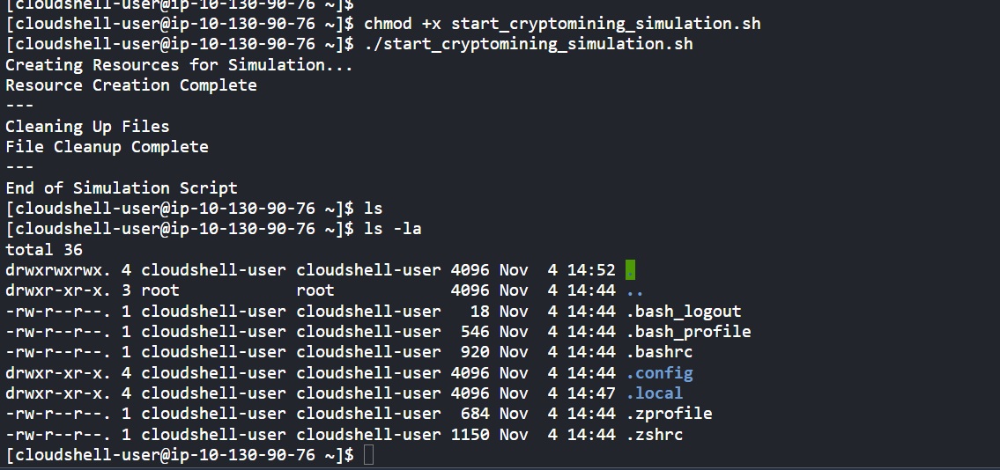 This created another stack in the CloudFormation called CRYPTO:

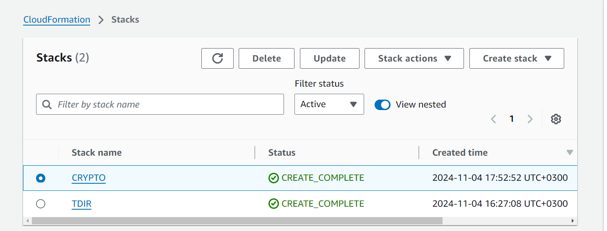

### Detection
Time for Our detections skills!


Using the environment created in the preceding sections, we will examine the simulated security incident involving the production of cryptomining resources. Questions that are frequently asked during a security event involving cryptomining will open each section. Each section's detection techniques will offer strategies for locating the answers to the queries as well as extra data pertinent to an inquiry.

### AWS CloudTrail Logs
AWS CloudTrail gives us control over storage, analysis, and remediation efforts by tracking and documenting account activity throughout your AWS infrastructure. Athena will be used in ths section to review and query the CloudTrail logs. Below are questions that were used as a guide for investigation.

#### Questions - AWS CloudTrail
1. What was the name of the CloudFormation stack created to simulate the security event?

2. An autoscaling group was created. What was the name of the autoscaling group?

3. What are the Instance IDs of the 3 EC2 Instances created by the autoscaling group?

4. EC2 instance credentials can be used to invoke APIs. Were any APIs (also known as eventname in CloudTrail) called by EC2 instance credentials? If so, what were these APIs?

5. Two EC2 instances were launched separately from the CloudFormation stack. What instance types were these EC2 instances (eg. t2.nano, t3.large)?

There are numerous API calls related to unauthorized crypto mining activity that can be used to query CloudTrail logs. Examples are:

`RunInstances`: Launches EC2 instances within an AWS account
`CreateStack`: Creates a CloudFormation stack according to a specified template
`CreateChangeSet`: Creates a list of changes that will be applied to a CloudFormation stack so that they can be reviewed prior to application. Can also then be used to run the CloudFormation stack.

TO query CloudTrail logs for execution of `createstack` we can run the command
`SELECT * FROM "irworkshopgluedatabase"."irworkshopgluetablecloudtrail" where eventname = 'CreateStack';`

where:
"irworkshopgluedatabase" is the database that has our logs,
"irworkshopgluetablecloudtrail" is the table to retrieve the specific data for the query "CreateStack"

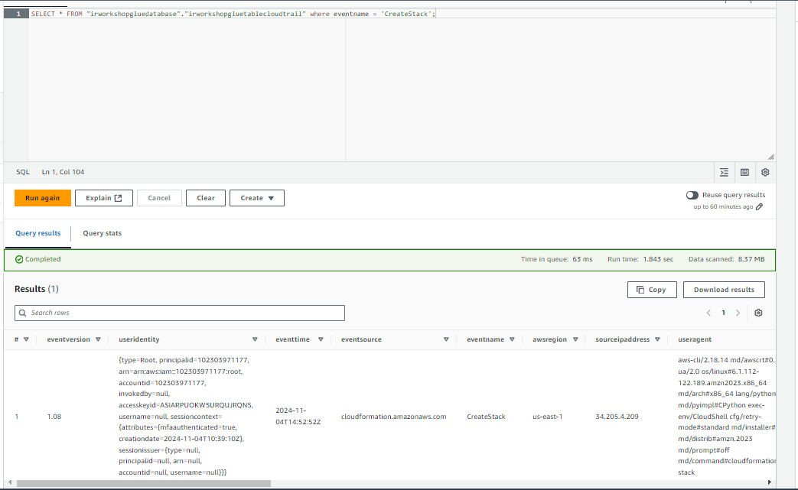

The results as shown below returned valuable data:
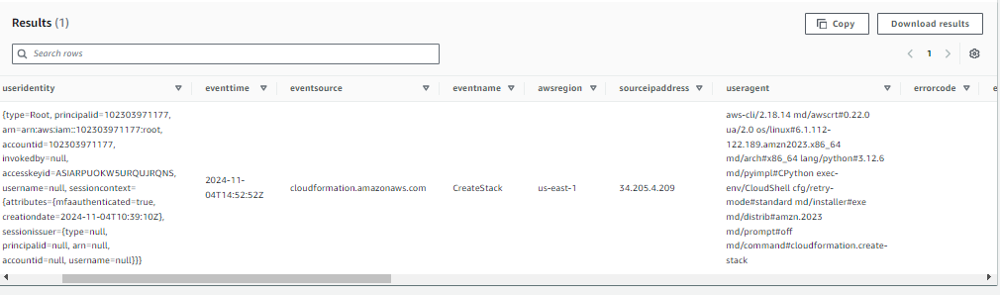

- useridentity: This column displays any IAM principals returned for the API call, including the AWS account used, any role assigned, and the username involved. Note the  useridentity.arn value as this will be used later on.

- eventtime: This column displays the date and time that CloudTrail logged the creation of the stack
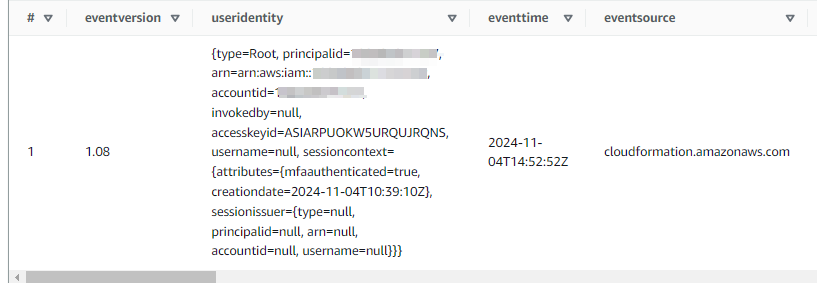

- sourceipaddress: This column includes the IP address of the host making the API call
- useragent: This column details the useragent configured on the host that initiated the API call

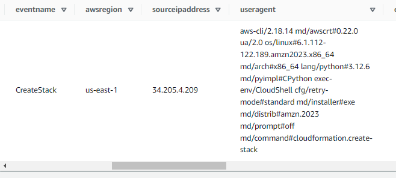

The query also returned  the columns named requestparameters and responseelements. The CloudFormation stackName and stackId was displayed in these two columns.
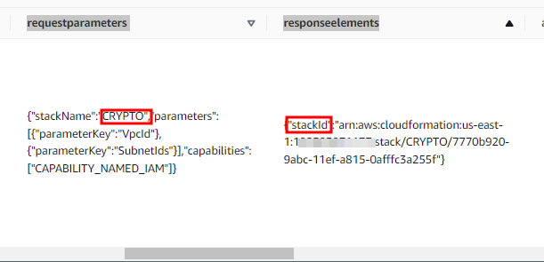

We can now use this information to discover more artifacts or data about this event. To do that, the command
`aws cloudformation describe-stack-resources --stack-name CRYPTO --query 'StackResources[*].ResourceType[]'` was used in AWS Cloudshell

aws cloudformation describe-stack-resources: This command fetches a list of resources that are part of the specified CloudFormation stack.

--stack-name CRYPTO: Specifies the name of the stack (in this case, "CRYPTO") to describe.

--query 'StackResources[*].ResourceType[]': This is a  query that filters the response to only return the ResourceType field for each resource in the stack.

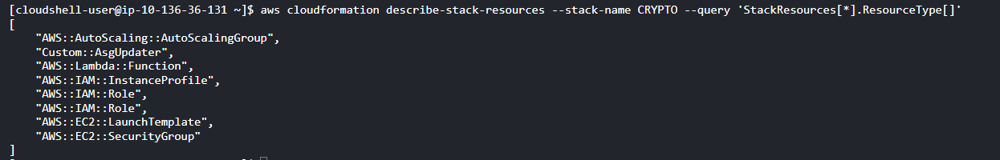

The command above retrieves a list of all resources created by the CRYPTO stack. While no `AWS::EC2::Instance` resources are directly created by this stack, it does include an `AWS::AutoScaling::AutoScalingGroup` resource. This indicates that an auto scaling group was employed to manage the EC2 instances utilized in the crypto mining operation.

**NOTE**: The AWS::AutoScaling::AutoScalingGroup resource in AWS CloudFormation is used to define an Auto Scaling group. Auto Scaling groups are a core component of Amazon EC2 Auto Scaling, and they allow you to automatically manage the number of EC2 instances running in your environment based on demand.

To obtain the  name of autoscaling group I added the AutoScalingGroup 'ResourceType' i.e
`aws cloudformation describe-stack-resources --stack-name CRYPTO --query 'StackResources[?ResourceType==`AWS::AutoScaling::AutoScalingGroup`].PhysicalResourceId'`

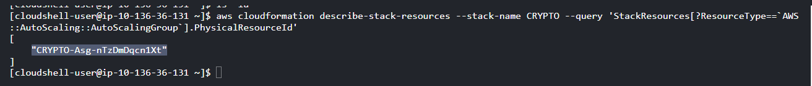

To further find the EC2 instances that were started by the autoscaling group the following command was used
`aws autoscaling describe-auto-scaling-groups --auto-scaling-group-names CRYPTO-Asg-nTzDmDqcn1Xt --query 'AutoScalingGroups[*].Instances[].InstanceId'`

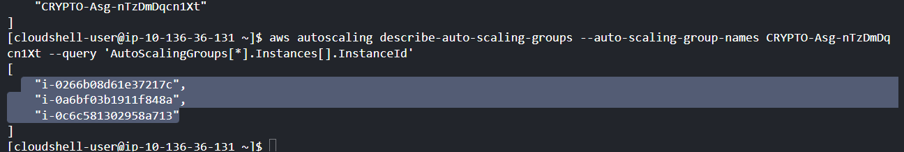

In the above image shows the EC2 instances IDs identified:
```bash
    "i-0266b08d61e37217c",
    "i-0a6bf03b1911f848a",
    "i-0c6c581302958a713"
```
To find out the scope of unauthorized use of the EC2 instances by using Athena to query CloudTrail. The following query was used
```bash
SELECT awsregion, useridentity.arn, eventsource, eventname, readonly, errorcode, errormessage, count(eventid) as COUNT 
FROM "irworkshopgluedatabase"."irworkshopgluetablecloudtrail"
WHERE eventsource = 'ec2.amazonaws.com' AND 
      (date_partition >= '2021/07/22' AND
      date_partition <= '2024/11/09') 
      AND 
     (
       requestparameters LIKE '%i-0266b08d61e37217c%' OR
       requestparameters LIKE '%i-0a6bf03b1911f848a%' OR
       requestparameters LIKE '%i-0c6c581302958a713%' OR
       responseelements  LIKE '%i-0266b08d61e37217c%' OR
       responseelements  LIKE '%i-0266b08d61e37217c%%' OR
       responseelements  LIKE '%i-0c6c581302958a713%' 
      )
GROUP BY awsregion, useridentity.arn, eventsource, eventname, readonly, errorcode, errormessage
ORDER BY COUNT DESC;
```

The requestparameters and responseelements include the EC2 Instance IDs obtained in the previous step
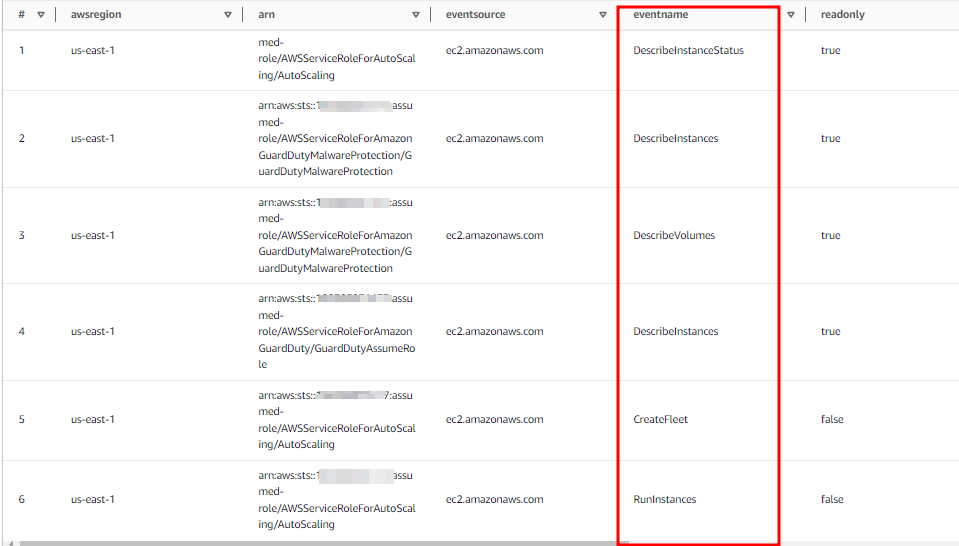

The results of this query seem relatively harmless—the only API calls made by any EC2 instances in this case were `DescribeInstanceStatus`, `DescribeInstances`, `DescribeVolumes`, `RunInstances`, and `CreateFleet`. However, this is not always true. An unauthorized user could potentially gain access to EC2 instance credentials and use them to make other API calls, such as `CreateUser` or even `ConsoleLogin`.

Although the previous query identified events where EC2 instances were involved as resources, it’s also important to review any activity where the `useridentity.arn` contains an EC2 instance ID. This would indicate that the EC2 instance credentials were directly used to perform an action. To find these activities, we can use the following query:

`SELECT awsregion, useridentity.arn, eventsource, eventname, readonly, errorcode, errormessage FROM "irworkshopgluedatabase"."irworkshopgluetablecloudtrail"
WHERE useridentity.arn LIKE '%i-%'`

Note that This query will typically include a lot of results from SSM, such as UpdateInstanceInformation and ListInstanceAssociations:

So we cn filter UpdateInstanceInformation and ListInstanceAssocations, as below:
`SELECT awsregion, useridentity.arn, eventsource, eventname, readonly, errorcode, errormessage FROM "irworkshopgluedatabase"."irworkshopgluetablecloudtrail" WHERE useridentity.arn LIKE '%i-%' AND eventname <> 'ListInstanceAssociations' AND eventname <> 'UpdateInstanceInformation'`

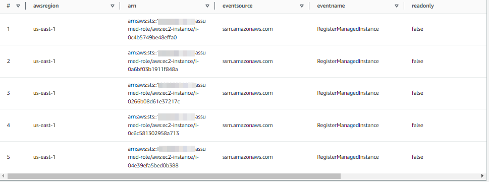

Using the useridentity.arn obtained earlier, we can identify other API calls that the identity attempted using the below Athena query
```bash
SELECT eventtime, awsregion, eventname, requestparameters, responseelements, errorcode, errormessage
FROM "irworkshopgluedatabase"."irworkshopgluetablecloudtrail"
WHERE useridentity.arn = 'arn:aws:iam::replace_this:user'
      AND date_partition >= '2021/07/22'
      AND date_partition <= '2024/11/09'
      AND eventname IN ('RunInstances')
```

This query will return all RunInstances events performed by the IAM user pipeline between July 22, 2021, and November 8, 2024, and will include:

The time when each event occurred (eventtime),
The AWS region where the action was performed (awsregion),
The name of the API action (eventname),
The parameters passed in the API request (requestparameters),
The response elements returned from the API (responseelements),
Any errors that occurred during the execution of the event (errorcode and errormessage)

During the simulation, we created other two EC2 instances using the `start_cryptomining_simulation.sh` script, which were not included in the resource group managed by the auto scaling group. These two instances are highlighted in the results. The `requestparameters` and `responseelements` columns contain details such as:

- Tags
- The `imageId`
- The `instanceType`

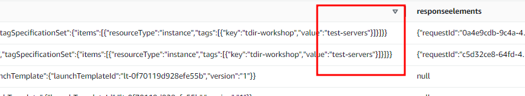

As advised by AWS, there are other more Athena queries that can be used to identify IOCs and they can be found [here](https://github.com/aws-samples/aws-incident-response-playbooks-workshop/blob/main/playbooks/crypto_mining/EC2_crypto_mining.md)


### Amazon Route53 Resolver Query Logs
Resolver Query Logging records DNS queries that originate from within Amazon VPCs. This was enabled during our setup phase. It enables us to track DNS queries generated by the simulated crypto mining activity conducted in the Simulation section. We will examine and query the Resolver Query Logs using Amazon Athena, which was also configured and enabled in our environment through CloudFormation.

When reviewing the Resolver Query Logs, we can focus on the following key areas:

- The most frequently requested domain names
- Potentially malicious domains
- The IP addresses and EC2 instances associated with the requests
- Any unusual record types requested, which may indicate command and control (C2) activity


Back to our now beloved Athena, to review the top requested domains the below query is used:
`SELECT "irworkshopgluedatabase"."irworkshopgluetabledns".query_name,
"irworkshopgluedatabase"."irworkshopgluetabledns".query_type,
"irworkshopgluedatabase"."irworkshopgluetabledns".srcaddr,
"irworkshopgluedatabase"."irworkshopgluetabledns".srcids,
count(*) as count
FROM "irworkshopgluedatabase"."irworkshopgluetabledns"
WHERE query_name NOT LIKE '%amazonaws.com%'
AND query_name NOT LIKE '%ec2.internal%'
GROUP BY "irworkshopgluedatabase"."irworkshopgluetabledns".query_name, "irworkshopgluedatabase"."irworkshopgluetabledns".query_type, "irworkshopgluedatabase"."irworkshopgluetabledns".srcaddr, "irworkshopgluedatabase"."irworkshopgluetabledns".srcids
ORDER BY count DESC`

The query will return a list of DNS queries (and associated metadata) while excluding *.amazonaws.com and *ec2.internal ordered by frequency. The columns in the output will be:

query_name: The domain name queried.
query_type: The type of DNS query (e.g., A, CNAME, etc.).
srcaddr: The IP address that made the query.
srcids: The source ID of the requester (could be an EC2 instance ID).
count: The number of times that particular combination of query_name, query_type, srcaddr, and srcids occurred.

The image below shows some results.

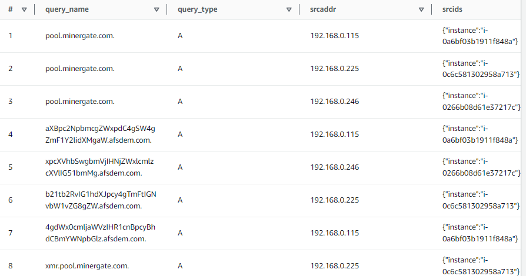

In the below example,
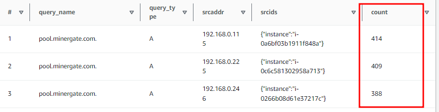
 shows that there were 414,409,388 requests from IP address 192.168.0.115,192.168.0.225,192.168.0.246 to the pool.minergate.com. host record - which is a domain associated with cryptomining.

 In AlienVault, we can do a search for the domain to see its legitimacy
 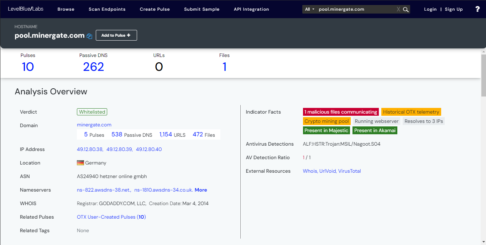

 We see it is a cryptomining site used by "ALF:HSTR:Trojan:MSIL/Nagoot.S04"

**NOTE**: Unusual record types may also signal unauthorized activity. To group queries by query type and identify uncommon types, you can examine the Resolver Query logs for record types such as A, AAAA, TXT, NULL, and CNAME using the following:
`SELECT "irworkshopgluedatabase"."irworkshopgluetabledns".query_type, 
"irworkshopgluedatabase"."irworkshopgluetabledns".query_name,
"irworkshopgluedatabase"."irworkshopgluetabledns".srcaddr,
"irworkshopgluedatabase"."irworkshopgluetabledns".srcids,
count(*) as count
FROM "irworkshopgluedatabase"."irworkshopgluetabledns"
WHERE query_name NOT LIKE '%amazonaws.com%'
AND query_name NOT LIKE '%ec2.internal%'
GROUP BY "irworkshopgluedatabase"."irworkshopgluetabledns".query_type, "irworkshopgluedatabase"."irworkshopgluetabledns".query_name,  "irworkshopgluedatabase"."irworkshopgluetabledns".srcaddr, "irworkshopgluedatabase"."irworkshopgluetabledns".srcids
ORDER BY count DESC`

If the most frequent query types include TXT, NULL, CNAME, or other rare record types, it could indicate potential unauthorized activity.

In our case it had A and AAAA records
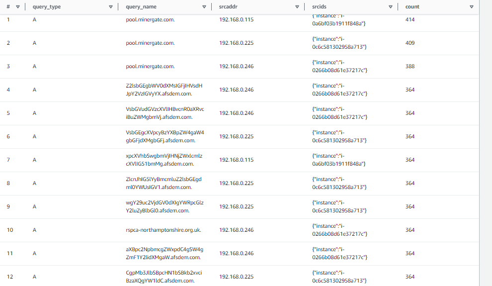


### Amazon VPC Flow logs
VPC Flow logging allows you to capture details about the IP traffic to and from network interfaces within your VPC. The flow log data can be published to Amazon CloudWatch Logs or Amazon S3. Once a flow log is created, you can access and review its data from the specified destination. VPC Flow logging was enabled in your environment during the Setup section via CloudFormation, and it will help us analyze traffic associated with the simulated crypto mining activity conducted in the Simulation section. We will use Amazon Athena to review and query the VPC Flow Logs.
There are several methods to identify potential indicators of compromise related to crypto mining activity using VPC Flow logs. Some key indicators include:

- **Packet Count**: This highlights the hosts with the highest overall packet count, which can indicate unusually high network activity.
- **Bytes Transferred**: This shows the source and destination IP addresses with the largest amount of data transferred, which could point to abnormal data movement.
- **Rejected TCP Connections**: This identifies the source IP addresses with the highest number of rejected TCP connections, potentially indicating unauthorized or suspicious access attempts.
- **Top HTTP Packets by Destination**: This metric reveals the destination IP address that receives the most HTTP packets from the VPC, which could help identify external servers involved in suspicious activity.

We can Use the query below to identify the hosts with the highest overall packet count
`SELECT "irworkshopgluedatabase"."irworkshopgluetablevpcflow".numpackets, "irworkshopgluedatabase"."irworkshopgluetablevpcflow".sourceaddress,
"irworkshopgluetablevpcflow".destinationaddress, "irworkshopgluetablevpcflow".destinationport
FROM "irworkshopgluedatabase"."irworkshopgluetablevpcflow"
WHERE flow_direction = 'egress' AND
destinationaddress NOT LIKE '192.168.%' AND
destinationaddress NOT LIKE '10.%' AND
destinationaddress NOT LIKE '172.%'
GROUP BY "irworkshopgluedatabase"."irworkshopgluetablevpcflow".numpackets, "irworkshopgluedatabase"."irworkshopgluetablevpcflow".sourceaddress,
"irworkshopgluetablevpcflow".destinationaddress, "irworkshopgluetablevpcflow".destinationport
ORDER BY "irworkshopgluedatabase"."irworkshopgluetablevpcflow".numpackets DESC`

The query will return a list of outbound traffic flows (egress), showing:

The number of packets transferred (numpackets),
The source IP address of the traffic (sourceaddress),
The external destination IP address (destinationaddress),
The destination port (destinationport),
The data will be sorted by the highest number of packets transferred, with the most active traffic appearing at the top.

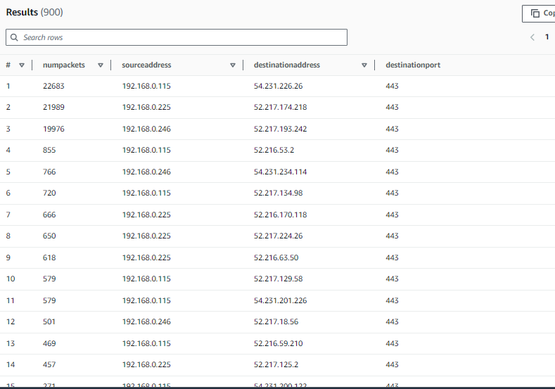

**NOTE** In the example above, the highest number of packets are sent from sourceaddress 192.168.0.115 to destinationaddress 54.231.226.26. In this example, the IP address of 54.231.226.26 currently belongs to Amazon, so these results could be filtered further to separate traffic within the Amazon infrastructure to traffic outside of the Amazon environment.
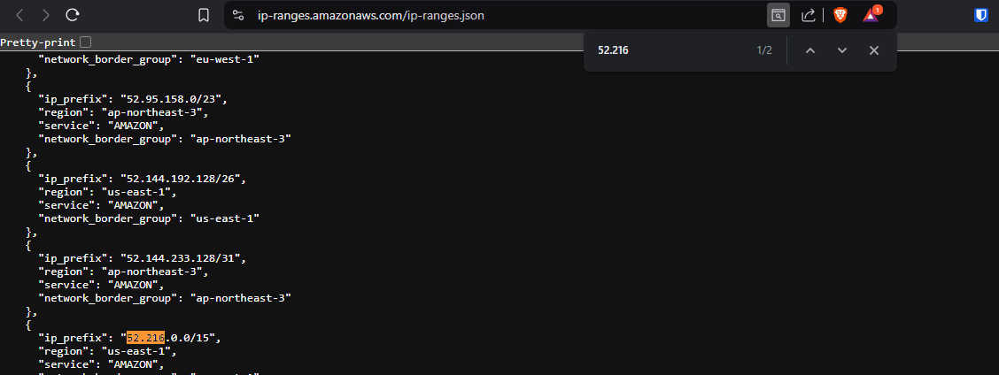

This [guide](https://docs.aws.amazon.com/general/latest/gr/aws-ip-ranges.html) assists in determing which IP addresses belong to Amazon

We can filter these IPs to remove false positives as below:
`SELECT "irworkshopgluedatabase"."irworkshopgluetablevpcflow".numbytes, "irworkshopgluedatabase"."irworkshopgluetablevpcflow".sourceaddress,
"irworkshopgluetablevpcflow".destinationaddress, "irworkshopgluetablevpcflow".destinationport
FROM "irworkshopgluedatabase"."irworkshopgluetablevpcflow"
WHERE flow_direction = 'egress' AND
destinationaddress NOT LIKE '192.168.%' AND
destinationaddress NOT LIKE '10.%' AND
destinationaddress NOT LIKE '172.%' AND
destinationaddress NOT LIKE '52.%' AND
destinationaddress NOT LIKE '54.%'
GROUP BY "irworkshopgluedatabase"."irworkshopgluetablevpcflow".numbytes, "irworkshopgluedatabase"."irworkshopgluetablevpcflow".sourceaddress,
"irworkshopgluetablevpcflow".destinationaddress, "irworkshopgluetablevpcflow".destinationport
ORDER BY "irworkshopgluedatabase"."irworkshopgluetablevpcflow".numbytes DESC`

The results now showed the IP 3.5.12.245 has the highest number of bytes
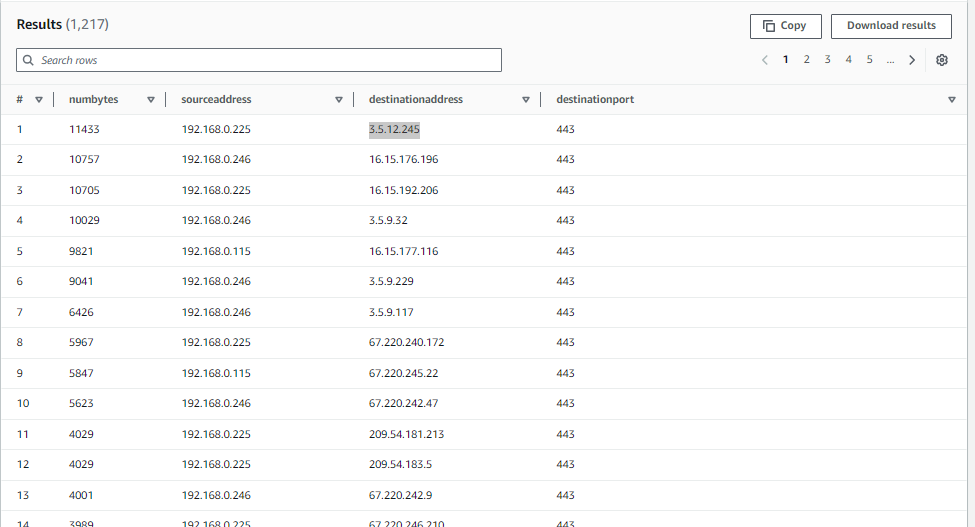

We can also write a query that identifies the most packets by HTTP/HTTPS destination port using port 80, 443, or 8443  and as our previous command we can filter the Amazon IPs:

`SELECT 
    "irworkshopgluedatabase"."irworkshopgluetablevpcflow".numpackets, 
    "irworkshopgluedatabase"."irworkshopgluetablevpcflow".action, 
    "irworkshopgluedatabase"."irworkshopgluetablevpcflow".destinationport, 
    "irworkshopgluedatabase"."irworkshopgluetablevpcflow".sourceaddress,
    "irworkshopgluetablevpcflow".destinationaddress,
    count(*) as count
FROM 
    "irworkshopgluedatabase"."irworkshopgluetablevpcflow"
WHERE 
    (destinationport = 80 OR destinationport = 443 OR destinationport = 8443) AND
    action = 'ACCEPT' AND
    destinationaddress NOT LIKE '192.168.%' AND
    destinationaddress NOT LIKE '10.%' AND
    destinationaddress NOT LIKE '172.%' AND
    destinationaddress NOT LIKE '52.%' AND
    destinationaddress NOT LIKE '54.%'
GROUP BY 
    "irworkshopgluedatabase"."irworkshopgluetablevpcflow".numpackets, 
    "irworkshopgluedatabase"."irworkshopgluetablevpcflow".action, 
    "irworkshopgluedatabase"."irworkshopgluetablevpcflow".destinationport, 
    "irworkshopgluedatabase"."irworkshopgluetablevpcflow".sourceaddress,
    "irworkshopgluetablevpcflow".destinationaddress
ORDER BY 
    count DESC
`
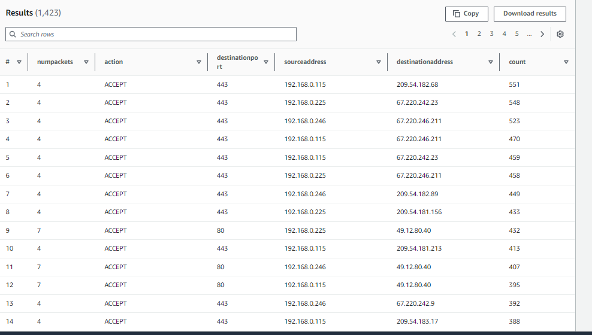

Additional Athena queries related to VPC logs can be found [here](https://github.com/aws-samples/aws-incident-response-playbooks-workshop/blob/main/playbooks/crypto_mining/EC2_crypto_mining.md)


### Amazon GuardDuty
Amazon GuardDuty is a threat detection service that constantly monitors your AWS accounts and workloads for potential malicious activity, providing detailed security findings to help with visibility and remediation. GuardDuty was already activated in our environment during the Setup phase using the CloudFormation template and is expected to detect the simulated crypto mining activity carried out in the Simulation section.

We can now move to GuardDuty in AWS to view GuardDuty findings.
Below is a summary of our GuardDuty:
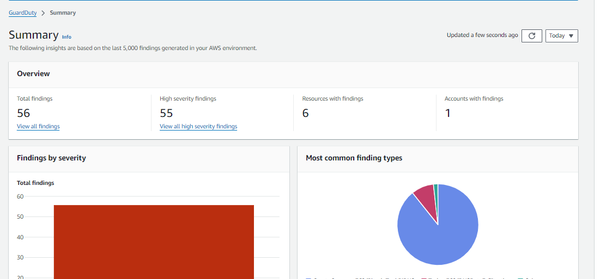

On Clicking on any alert, then info:
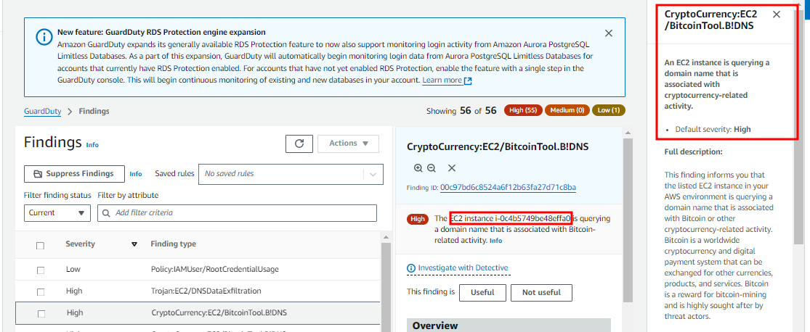
We can see the EC2 instance and a description at the right of the alert.

We can also observe the launch time, this is in reference to when our script was created and launched.
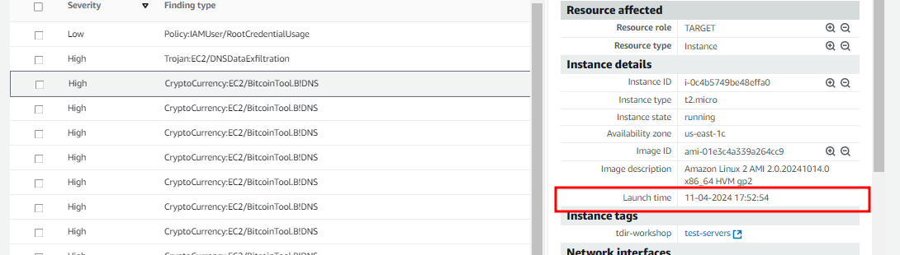

The instance tags are also important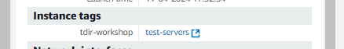
In another alert we cann see our CloudFormation stack IDs:
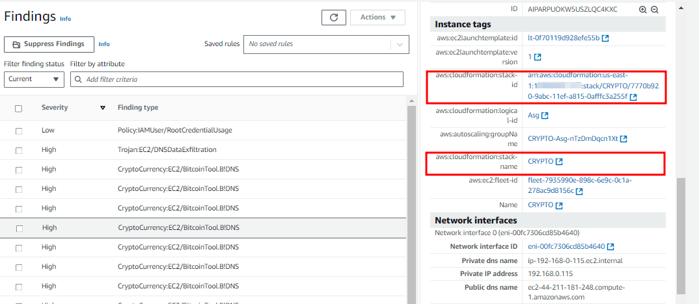

Now we can also see the Domain name that was requested and the action whether it was blocked or not.
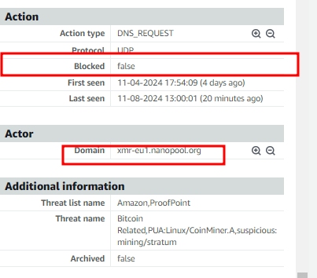

In our Simulation, Three EC2 instances were created, but security incidents involving crypto mining can often involve a larger number of EC2 instances. A bash script is provided to query GuardDuty findings and quickly identify the Instance IDs of EC2 instances linked to a crypto mining security event. We use the bash script in the AWS cloudshell as shown below.

`detector_id=$(aws guardduty list-detectors --region us-east-1 | jq -r '.DetectorIds[]')
finding_ids=$(aws guardduty list-findings --detector-id ${detector_id} --finding-criteria 'Criterion={type={Eq="CryptoCurrency:EC2/BitcoinTool.B!DNS"}}' --region us-east-1 | jq -r '.FindingIds[]')
(for finding_id in ${finding_ids}; do aws guardduty get-findings --detector-id ${detector_id} --finding-id ${finding_id} --region us-east-1; done | jq -r '.Findings[].Resource.InstanceDetails.InstanceId') > instance_ids.txt
cat instance_ids.txt | sed 's/ /\n/g' | sort -n | uniq`

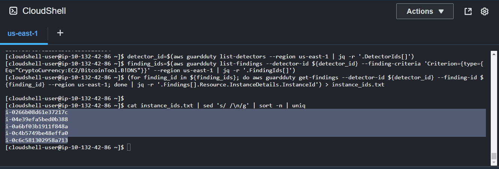

We can see now in this script GuardDuty provided us with valuable info as well as 5 EC2 instances which 2 more were created in "tdir-workshop" 

### Lessons Learnt
Here are some few things I learnt during this process:
- **Simulating Cryptomining Activity**: 
  - Used AWS CloudShell to simulate a cryptomining-related security event.
  - Event populated CloudTrail, VPC Flow logs, and triggered GuardDuty findings.

- **Setup with CloudFormation**: 
  - Used CloudFormation to configure the detection and analysis environment.
  - Added a CloudTrail trail for monitoring API activity.
  - Set up VPC Flow logs to capture network traffic data.
  - Enabled Route53 DNS Resolver Query logs for DNS activity tracking.
  
- **Athena Configuration**: 
  - Configured Amazon Athena to review and query the logs.
  - Ran sample queries to explore log data.


- **Detection Techniques**:
  - Reviewed common API calls related to cryptomining activity, such as `CreateStack`.
  - Used Athena to query unauthorized EC2 instances and analyze their activity scope.
  - Used GuardDuty to view all the findings in one place
  
- **Route53 DNS Resolver Query Logs**: 
  - Identified domains associated with cryptomining activity in Route53 logs.

- **VPC Flow Logs Analysis**:
  - Used Athena to query VPC Flow logs for:
    - Hosts with the highest overall packet count.
    - IP addresses with the largest amount of bytes transferred.
    - Hosts with the most rejected TCP connections.
    - Destinations receiving the most HTTP packets.

This is the end of the blog! This was a new discovery to me in terms of Incidence Response in AWS, Lots of cool things learnt.
Remember to do your Cleanup of the AWS environment so as not to incur additional charges

Here is a link for the [cleanup](https://catalog.us-east-1.prod.workshops.aws/workshops/ea9c0361-001f-4194-963e-06b07c3e5d6b/en-US/cleanup)

Till Next time!
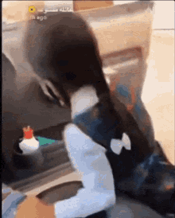

