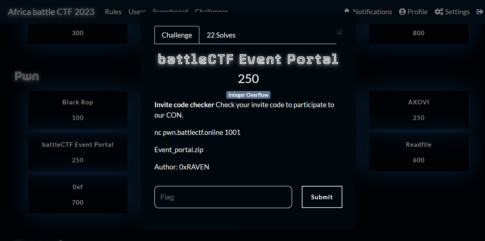
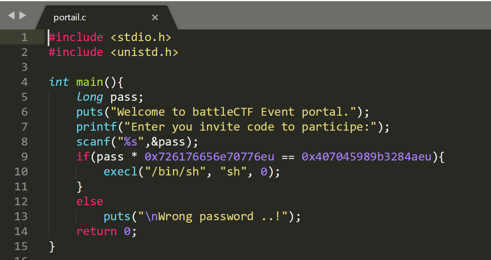
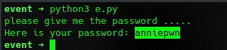
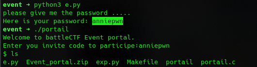

I Recently participated in the africa battle ctf 2023, In this blog I will cover some of the challenges I tackled. In all honesty, some challenges I tackled during the CTF and some after the CTF.

#### battleCTF Event Portal

This pwn Challenge was pretty easy, I wondered why it had less solves, but let's get into it.
We can see the challenge category is integer overflow. First I opened the C file given to see the flow of code.



We see a call to puts which prints a statement then we see a printf followed by a scanf which prompts the user for a pass. It is then followed by an if function which we see calls bin/sh else it prints wrong password in the else function. So we need to get the pass so that we can execute the if function to get bin/sh. Looking at the category we see it is an integer overflow challenge. That right away gave me an idea of what I was going to do. 
When an arithmetic operation on two numbers results in a result that is larger than the largest value that the data type of the integers can represent, this phenomenon is known as integer overflow. This can result in unexpected and possibly inaccurate results since the operation's result will wrap around to the lowest number that the data type can support.

In C we know the max value is 0xffffffffffffffff . But we see to get the pass we need to do this function "pass * 0x726176656e70776eu == 0x407045989b3284aeu". 
[Theguyintuxedo](https://guyinatuxedo.github.io/35-integer_exploitation/puzzle/index.html) explains integer overflow better.

So to get the pass we can write a script to solve that.
```python
from z3 import *

get_pass = Solver()

x = BitVec("x", 64)

get_pass.add(((x * 0x726176656e70776e) & 0xffffffffffffffff) == 0x407045989b3284ae)

if get_pass.check() == sat:
    solution = get_pass.model()
    solution = hex(int(str(solution[x])))
    solution = solution[2:]

    #  Reverse the value
    value = ""
    i = int(len(solution) / 2)
    while i > 0:
        i -= 1
        y = solution[(i*2):(i*2) + 2]
        value += chr(int("0x" + y, 16))

    print("please give me the password .....")
    print("Here is your password: " +value)
else:
    print("something must be wrong!!")
```
Running that should gives us the answer.

 
Run the password on the executable should give us a shell.
 Sweet we get our shell.


More Coming soon!