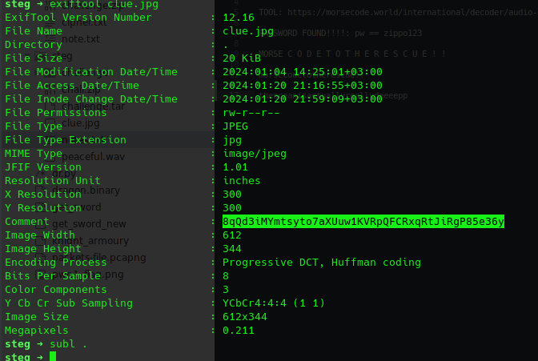
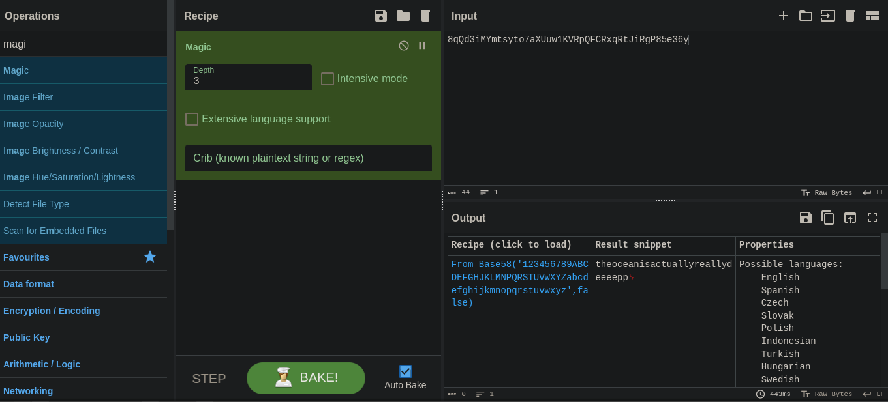
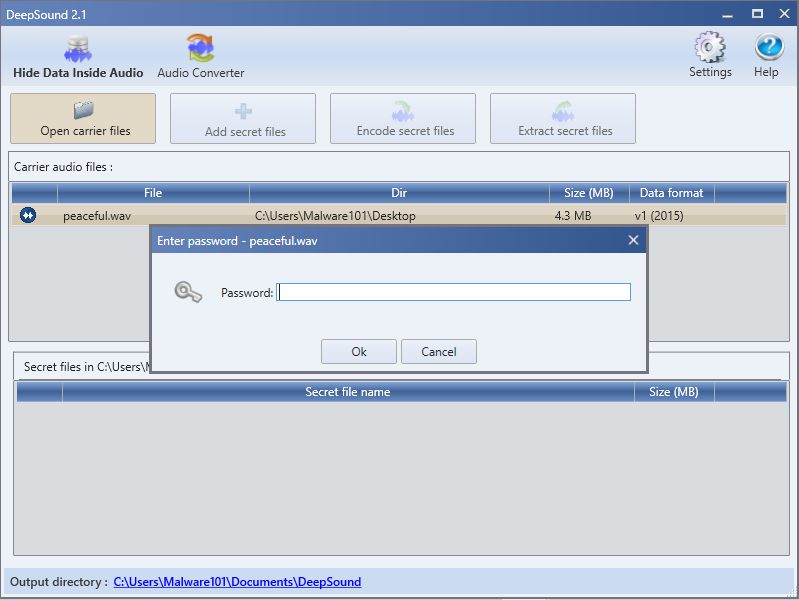
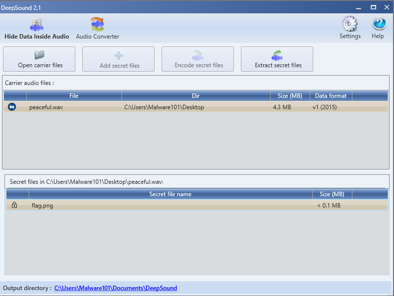
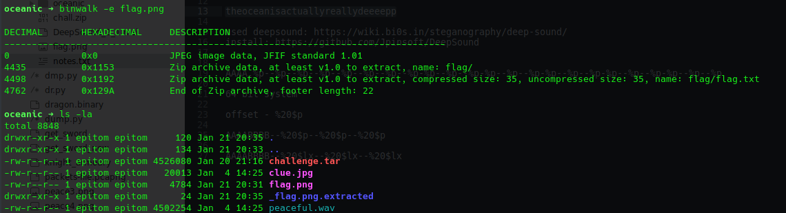
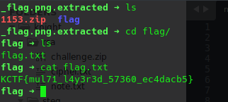
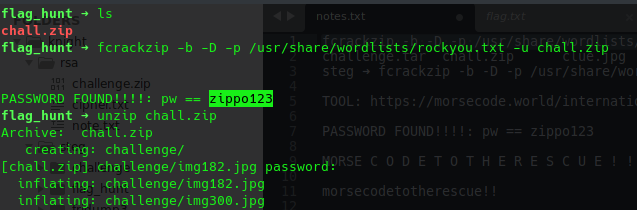
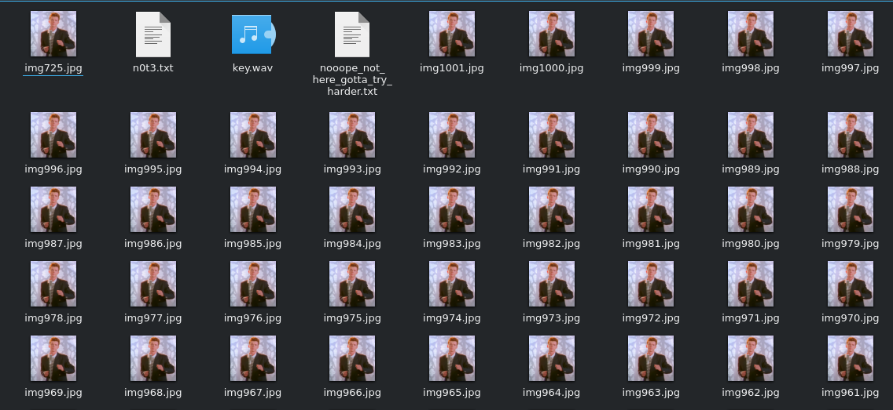
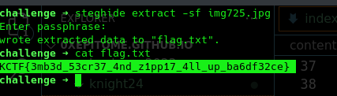
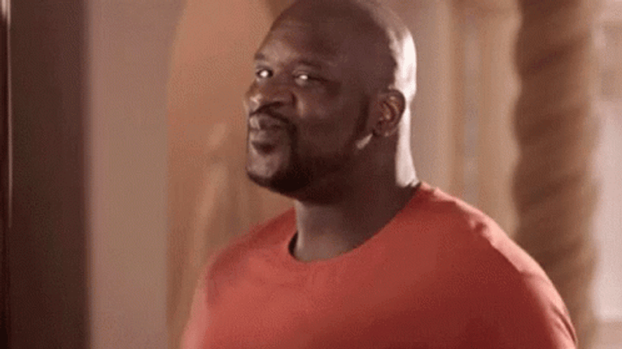

Writeups for steg challenges that I solved with my [team](https://ctftime.org/team/206364)

#### Oceanic
We are given a tar file:
Upon extracting, we get 2 files; `clue.jpg,peaceful.wav`
Checking metadata using exiftool of the clue.jpg, we get an interesting time which was encoded in base58;

I used cyberchef to decode the content and I got some word "theoceanisactuallyreallydeeeepp" 

Remember also we were given a wav file, I tried using sonic visualizer and git into a rabbit hole thinking there was some sort of morse code. To cut the long story, I came across this [page](https://wiki.bi0s.in/steganography/deep-sound/)
Which explained a tool called [deepsound](https://github.com/Jpinsoft/DeepSound) that can be used to discover files hidden in a wav file.

I installed the tool and upon opening it and selecting our wav file it prompted me a password;  
I went back to the string we had found and entered it as password and it worked.
 I extracted the flag.png to my machine and this is where I took some time. The tool I used was "binwalk" and extracted the files in the image and got the flag.

`KCTF{mul71_l4y3r3d_57360_ec4dacb5}`

#### Flag Hunt

This was a nice challenge with me ending being rick rolled!
Anyway for this we are given a chall.zip, try extracting it requires a password. I cracked the zip file using frackzip;
`fcrackzip -b -D -p /usr/share/wordlists/rockyou.txt -u chall.zip`

We get a lot of images and some 2 txt files and a wav file(again!!).
I opened my file explorer and since I always sort my files according to size one image stood out to me which was "img725.jpg".
 and sure enough that image had more bytes than the rest of the images. I tried cracking the image using stegseek but could not find a valid password. I left that for a while and decided to go to the wav file. On playing it I had some beeps and immediately I knew it was morse code.
I used this [tool](https://morsecode.world/international/decoder/audio-decoder-adaptive.html) to decode the audio and I got the following text
`MORSECODETOTHERESCUE!!`
I went back to the image and I used steghide to extract using the found content but it wasn't valid.
It dawned on me that I hadn't read the other text files. One particularly stood out which said
`The flag is here somewhere. Keep Searching.. Tip: Use lowercase only` 

I put now the found password in small letters `morsecodetotherescue!!` and tried using steghide again. Found Flag!!

`KCTF{3mb3d_53cr37_4nd_z1pp17_4ll_up_ba6df32ce}`

Bye!!

