Below are my writeups for all my challenges, I will not be covering welcome and sanity, for sanity you just had to raise a ticket and ask the bot for the flag. The bot responds in some base64 text, decode that and get the flag 

### Insanity Check

The aim of this challenge was supposed to be as guessy as possible, hence the name.

```
Challenge Description
Author: [0xEpitome](https://x.com/0xEpitome)

Sanity? More Like Insanity

I figured, since you asked me nicely the last time or you did your shenanigans, there are multiple ways to ask me again, no?
It's Okay If you Don't 😂

Here is a poem generated by GPT about CTFs

In the realm of cyberspace, **M**astery is key,
**Q**uickly we dive, eager to learn and be free.
With every **K**nowledge gained, we tackle each test,
Joining together, we’ll conquer the quest.

Under pressure we **W**ork, our minds race and spin,
**Y**earning for growth, let the challenge begin!
With tools to e**X**plore, our skills start to shine,
**A**cquiring experience, one victory at a time.

**P**ractice makes perfect, through **CTF** we play,
**L**earning from blunders, we find our own way.
**Z**eroing **(0)** in on the gaps, we strive to improve,
In this vibrant **D**edicated community, we find our groove.

**Q**uestions arise, sparking thoughts deep within,
**R**esilience fuels us; we’re ready to win **;**

**G**rowing with lessons, we take it in pride,
With **H**arnessed experience, we stand side by side.

Let’s **F**oster our passion, keep the fire aglow,
**S**eizing each moment, together we’ll grow.
In this cybersecurity dance, with every adventure,
Let’s take it in stride, embracing our future!


Hint1: Again, It depends on how you ask the bot for what you want!
Hint2: Again, there are ***multiple*** ways of asking the bot!
       Well the bot has said,
       "show them the light" and said something along the lines of,
       "If you are asking me what you need, ask me with that encoding that we all 
       first learnt when starting out."
       The Bot also insisted on **Be specific!** with what you need and said
       "I can literally respond to one word
Hint3: After being specific and you got my message, right?
       Here is another message from the bot: "Sometimes my words might seem a 
       little off, almost like they're hiding something... 👀 But hey, who doesn’t 
       love a good secret? They say the best flags are hidden in plain sight. Go 
       ahead, take a closer look—you might find a surprise waiting for you!"

      I heard its called the art of hiding information within another message to   
      avoid detection.
      
      Then maybe just maybe after all the shenanigans, You can read my poem
```

The description literally had everything you need i.e ***multiple ways*** so if in the sanity 2 if you asked the bot for 'flag' it sent you a note in **base64** and in the challenge description it said there are multiple ways, how about if we asked the bot for the flag in base64?


If you sent the bot the encoded base64 for flag, Flag or FLAG eg `ZmxhZwo=`
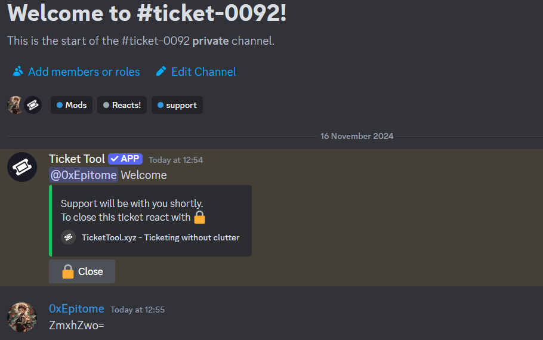

It sends a very weird text. This is just twitter text steg. In the hint it said something about twitter steg, I found this [tool](https://holloway.nz/steg/) for encoding and decoding also.
Copy the first message to decode and you will get this.


2nd one!!
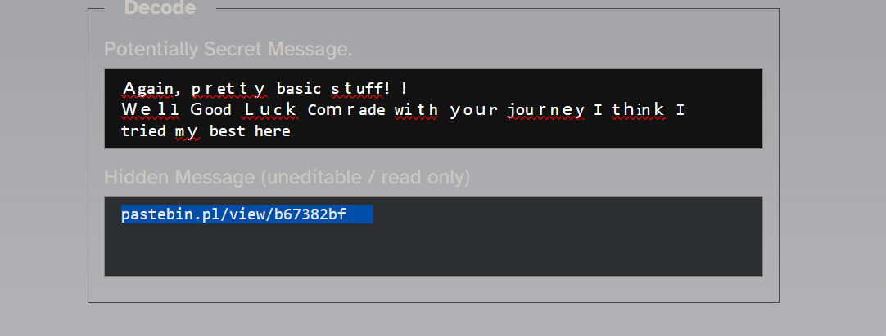

If you open the 2 pastebins i.e
`pastebin.pl/view/e205c8c5`
`pastebin.pl/view/b67382bf`

The first one you will get what you are looking for, Rick Roll!!!


The 2nd one will take you a Gdrive link with a text file with a python code


The script is pretty easy to understand, it takes a a string encoded in base64 and executes it as below:
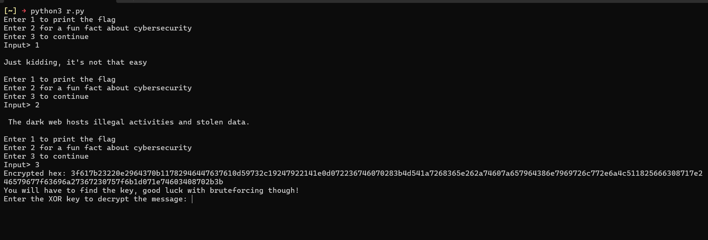

We see there are 3 functions 1 to print the flag, obviously a lie, 2nd to print a random fact and 3 there's some xor and we are given the hex, well you just need the xor key and try to decode the hex, the key was now in the poem provided in the description, if you observed there were some bolded characters `MQKWYXAPCTFLZ(0)DQR;GHFS`
Paste this to the code:

 Get the Flag 
 `r00t{Vh4t_W4snt_s0_b4d_w4s_IT_cf746daed369deab237423a689181b0da1a71366b6464402ff1d33157701f37c}`

### Power Derby

Here we are given a zip file with the password as `infected`, this was extracting a PS1 file
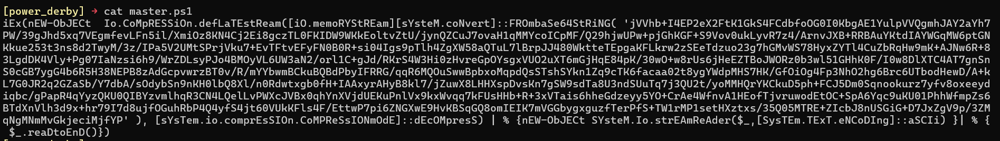

The best way to decode a powershell file is to let the script do the heavy lifting, in the code we see an iex (Invoke-Expression). The Invoke-Expression cmdlet returns the output of the expression or command after evaluating or running a given string as a command. A string entered at the command line is echoed or unaltered in the absence of invoke-expression. 
The script generally does the following:
- **Base64 Decoding**: It decodes a Base64-encoded string into binary data.
    
- **Decompression**: The binary data is decompressed using the Deflate compression algorithm.
    
- **Stream Reading**: The decompressed data is treated as a stream and read as text using ASCII encoding.

So we can remove the iex cmdlet and assign the rest of the string to a variable


Then we can just ran the variable, to see its contents:


This script is a simple script I copied from [github]( https://github.com/Whitecat18/Powershell-Scripts-for-Hackers-and-Pentesters) that outputs the system information of a machine, apart from the script we see random comments, which are what seem like base64 code, compile them and decode them to see what they are:
 Cyberchef is way does it way easier
 

The decoded base64:
```powershell
( $SHELLiD[1]+$sHELLID[13]+'X')( ( [cHAR[]] (87, 91,24,94 , 65,89 , 92,115, 38 , 88 , 28 ,28 ,115, 105 , 24 , 95, 85, 115, 38 , 29 , 74,115, 85 ,28, 89 , 115 , 109, 95,71,115 , 38,65 , 31, 115,20 ,78 ,25, 79 , 26, 24, 25 , 30,78 , 27 , 31,24 ,20,78, 21,25,79,73, 72 ,73 , 25, 28,24, 77,74 ,74, 24 , 20 ,28 , 29, 74,21, 81) 
| FoREacH-oBjECt { [cHAR]($_ -BxoR "0x2C" ) } ) -JOin'' )
```

The general purpose of this code, it is performing bitwise xor with the value 0x2c and after applying the bxor the result is converted to a string using [CHAR].  `$SHELLID` is a predefined PowerShell variable that contains the name of the current shell host, such as `ConsoleHost`

Now to decode back to cyberchef we can copy these values in hex and since we know the key perform the operation, we can have a script in powershell that does the work:
```powershell
$encoded = @(87, 91, 24, 94, 65, 89, 92, 115, 38, 88, 28, 28, 115, 105, 24, 95, 85, 115, 38, 29, 74, 115, 85, 28, 89, 115, 109, 95, 71, 115, 38, 65, 31, 115, 20, 78, 25, 79, 26, 24, 25, 30, 78, 27, 31, 24, 20, 78, 21, 25, 79, 73, 72, 73, 25, 28, 24, 77, 74, 74, 24, 20, 28, 29, 74, 21, 81)

$key = 0x2C

$decodedCharacters = $encoded | ForEach-Object { [char]($_ -bxor $key) }

$decodedString = -join $decodedCharacters

Write-Host "Flag: $decodedString"

```

the '@' allows us to pass multiple parameters to a variable, running it gives us the flag.
`{w4rmup_t00_E4sy_1f_y0u_Ask_m3_8b5c6452b7348b95cede504aff4801f9}`


### What the Shell 1 
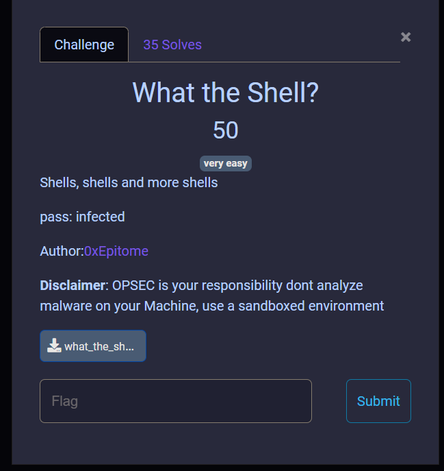

 This was an easy shellcode challenge which you were provided a .bin file.
 Shellcode is well explained in this [blog](https://medium.com/@avaen/extraction-and-analysis-of-injected-shellcode-77445e8b6504)
 
 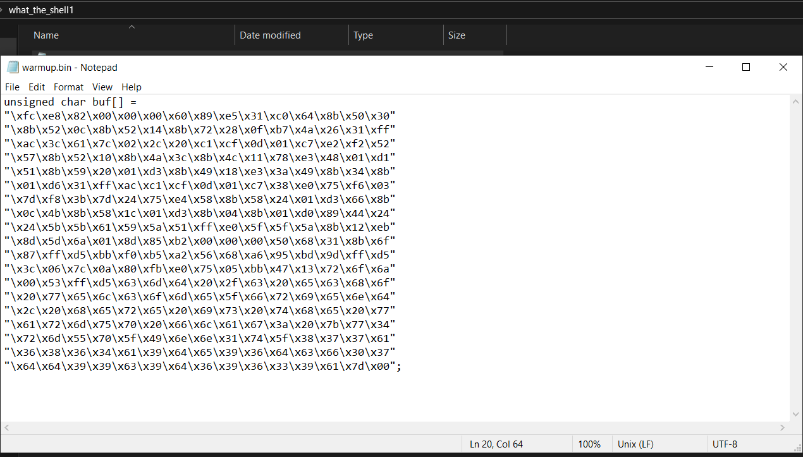

`NOTE: Although the files provided for the malware challenges were not harmful, it's always advisable to investigate malware in a controlled environment' `

In my case I am using [Flare VM](https://github.com/mandiant/flare-vm) which comes pre installed with many tools for malware analysis

I recently noted that you can decode shellcode by using python but it's not that clean. So the intended way was to use shellcode tools eg scdbg(shellcode debug) to debug the shellcode. There are many tools that can do it, but scdbg works best for me.

We can clean this shellcode so that we remain with the shellcode only as follows:


I am using Flare Vm for this, in scdbg we need 2 options that is /f which is for the path of the bin file and /s -1 which is for steps until the tool completes.

`scdbg.exe /f C:\Users\Malware101\Desktop\what_the_shell1\warmup.bin -s -1`
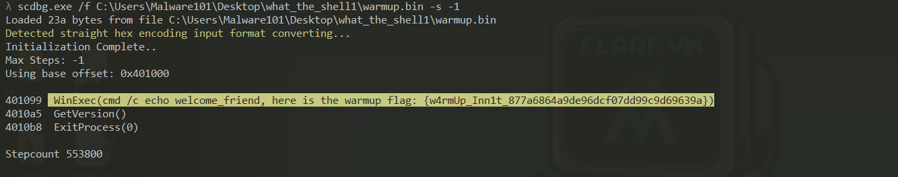

The shellcode does execute a cmd prompt which echoes the flag.

`flag: {w4rmUp_Inn1t_877a6864a9de96dcf07dd99c9d69639a}'`


### What the Shell? 2


For this it was an exe file,  
#### Unintented Solve
The easiest way to solve this was through checking the processes created by the file on procmon. Process Monitor(procmon) is an advanced monitoring tool for Windows that shows real-time file system, Registry and process/thread activity.
You can get procmon [here](https://learn.microsoft.com/en-us/sysinternals/downloads/procmon)

In procmon set filter:


When we run the file, we should see some activity on procmon:


We can see it opens a message box saying "Hey, welcome to part two", also in procmon we see activity, going to process tree in procmon:


We see the exe file has 2 sub-processes with the most interesting being powershell child process, in this process: 


The following command is being ran on the background:
```powershell
powershell.exe -EncodedCommand JABUAGUAbQBwAFAAYQB0AGgAIAA9ACAAWwBTAHkAcwB0AGUAbQAuAEkATwAuAFAAYQB0AGgAXQA6ADoARwBlAHQAVABlAG0AcABQAGEAdABoACgAKQA7ACAAJABGAGkAbABlAFAAYQB0AGgAIAA9ACAAIgAkAFQAZQBtAHAAUABhAHQAaABcAFwAZgBsAGEAZwAuAHQAeAB0ACIAOwAgACIASABlAHIAZQAgAGkAcwAgAHkAbwB1AHIAIABmAGwAYQBnACAAewBBAF8AVgAzAHIAeQBfAE4AMAAxAHMAeQBfAFMAaAA0AGwAbABjADAAZAAzAF8AMwA5AGYANwA3AGUAZgA3ADcAYQA5ADQANQAwADEANgA3ADgAOABkAGUAYgBhADAAOABlADkAZABkADAANAA1ADYAMABjAGEAYwBlAGMAZgAxADcAYgA4ADQANQAyADQAMQBiADcANABjAGMAOQBhAGYANQBkAGUAMQAyAGYAZABkADAANgBmAGQAMwA2ADgAZQA1AGIANwBmADMAYQAyAGIANQA1AGEAMQA1ADYANQAxAGUAMAAxAGQAMwA5ADkAZgBhAGYAMwAzADQANAAyAGIAZgAzADQANAAyADYAZgBhADAAMQA4ADUAOQBhADcANQA0ADIAMAA0AGIAYwA4AH0AIgAgAHwAIABPAHUAdAAtAEYAaQBsAGUAIAAtAEYAaQBsAGUAUABhAHQAaAAgACQARgBpAGwAZQBQAGEAdABoAA==
```

Decoded the base64 code in cyberchef and remove null bytes:
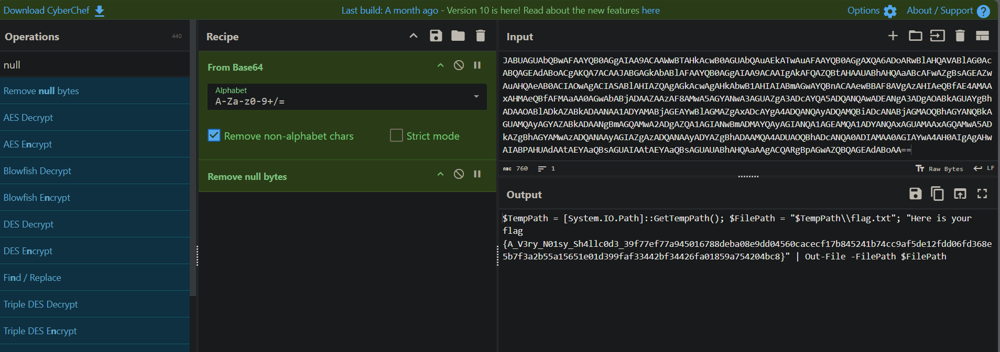

We see the command takes TempPath which is TEMP dir in windows and puts a flag.txt with the note that is our flag.
We can verify this by going to the temp directory and checking the flag.txt to see if we will get our flag.


#### Intended Solve
For the intended we will use x64dbg to debug our exe file and extract the shellcode.
Most of the shellcodes, they are stored in 3 areas mostly .text, .rsrc and .data sections of a PE file, this can be confirmed in [pestudio]([Winitor](https://www.winitor.com/download)):


It is also good to note that, we can also see the functions used by the exe in pestudio:


The flags with x are the most relevant and these functions show the classic pattern of shellcode injection, hence another indicator the exe has a shellcode. 

We can extract the shellcode now in x64dbg. in x64dbg go to memory map and look for our executable. Since we already 3 memory regions, we should look for the one with read, write, execute which is the .data section


To dump it we follow it in dump as save it as a .bin file so as to use the scdbg


We can already see hints of powershell encoded command as the one seen on procmon, copy the whole data go to binary, save to a file, I saved mine to flag.bin.

Now we use scdbg as our whattheshell1 code or decoding the powershell and we should get our flag
```bash
flag: {A_V3ry_N01sy_Sh4llc0d3_39f77ef77a945016788deba08e9dd04560cacecf17b8  
45241b74cc9af5de12fdd06fd368e5b7f3a2b55a15651e01d399faf33442bf34426fa01859a754204bc8}
```

### Hackers Catch


The 2 challenges were game rev challenges which their aim was to test the use of the basics of [Cheat Engine](https://www.cheatengine.org/)

When we run the  game:


We can see a little description that hinted the game was being timed, in this case I made it 10 seconds, so we had 10 seconds to reach a score of 100/100 in order to get the "reward". 
This is pretty straightforward. Open cheat engine and attach the process to cheat engine.


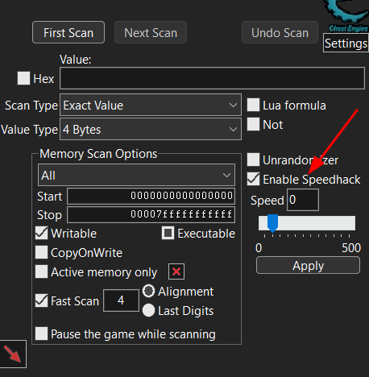

We can enable speedhack and set it to 0 so in laymans terms the game is slowed down, and now we can chase the ball at our own pace with no restriction of time.


`flag: {G0_4nd_t0uch_gr4ss_0r_else}`


### Hackers Catch 2


This challenge was compiled using godot, the aim of this challenge was to collect 14 flags and the enemy would disappear and we will get to the reward.


When we get to the 1st enemy:


2nd enemy:
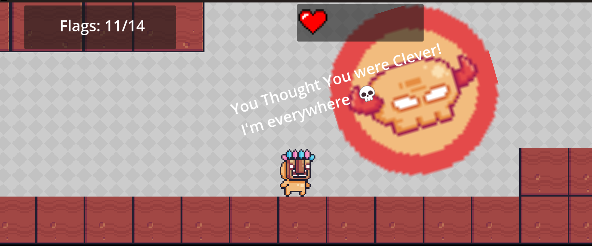

It is also important to note when the enemy was touched a life was decreased, to solve this we needed to use cheat engine to modify the value of the flags to be 14/14 before we reach to the enemy, here is how you can do that:

Attach process to cheat engine:
Now in the scan tab:


We can set the value to 1 since we know the increment of the flags value to be 1 and since it is the first time we are scanning, in the game we collect the first flag and back to cheat engine we click first scan.


This brings many results, so we search for the next pattern which is 2, and we click next scan, we do this until we find the correct address that holds the flag value.


These produced less output which we can monitor. At the 3rd flag, we can start changing the values of the addresses, click on first address and add it to the memory view.


In memory view we can change the value from 3 to 14 now since we found our address


Now when we collect another flag, we should see the flags value change:


Here now we can go and collect our reward:


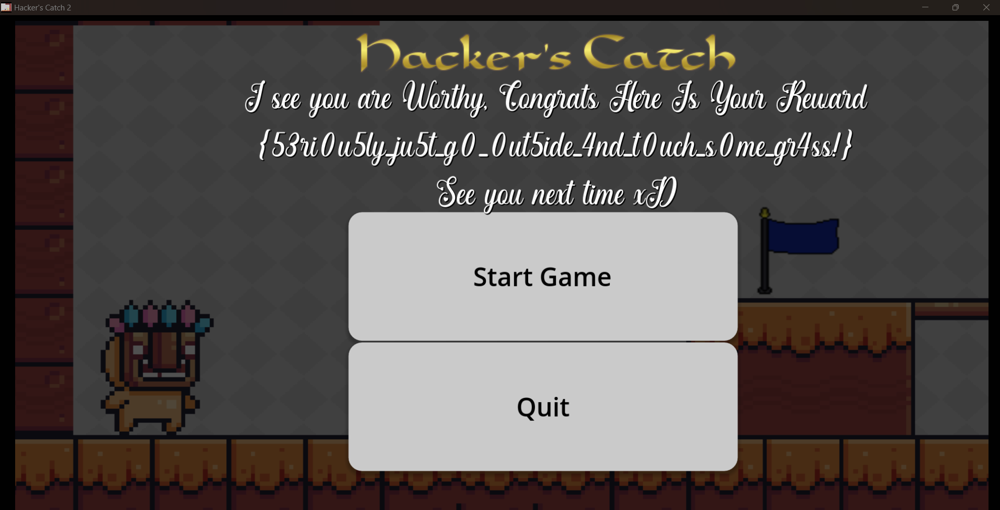

`flag: {53ri0u5ly_ju5t_g0_0ut5ide_4nd_t0uch_s0me_gr4ss!}`

I hope you learnt a thing or 2 from the challenges and also enjoyed generally our first CTF. 
See you next time!


